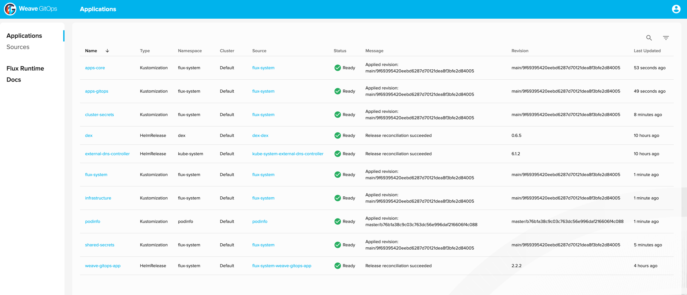
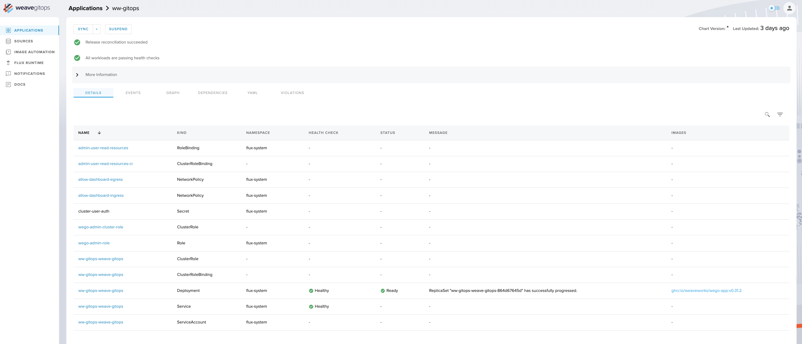
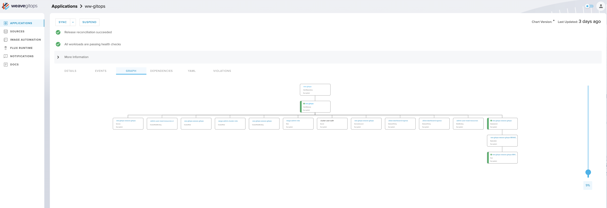
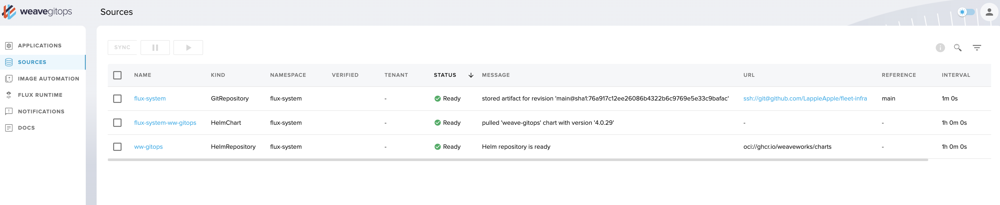
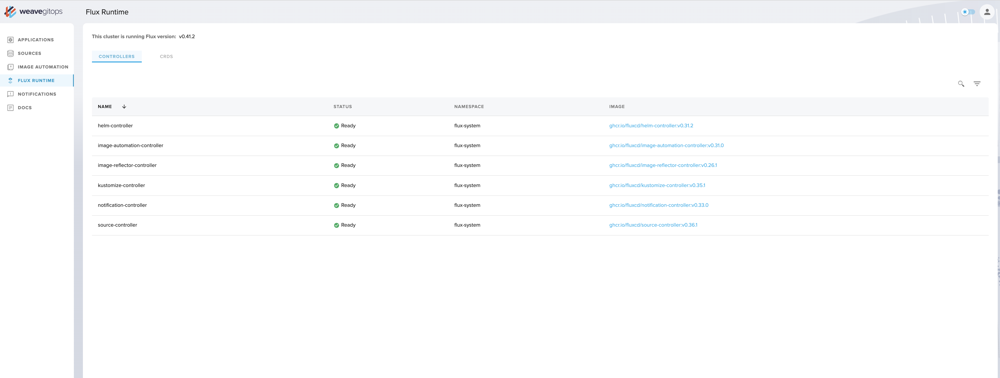

# Weave GitOps


[](https://github.com/weaveworks/weave-gitops/blob/master/LICENSE)
[](https://github.com/weaveworks/weave-gitops/graphs/contributors)
[](https://github.com/weaveworks/weave-gitops/releases/latest)
[](https://conventionalcommits.org)
[](https://app.fossa.com/projects/git%2Bgithub.com%2Fweaveworks%2Fweave-gitops?ref=badge_shield&issueType=license)
[](https://app.fossa.com/projects/git%2Bgithub.com%2Fweaveworks%2Fweave-gitops?ref=badge_shield&issueType=security)
[](https://www.bestpractices.dev/projects/7820)
[](https://scorecard.dev/viewer/?uri=github.com/weaveworks/weave-gitops)
[](https://goreportcard.com/report/github.com/weaveworks/weave-gitops)

Weave GitOps is a simple, open source developer platform for people who want cloud native applications but who don't have
Kubernetes expertise. Experience how easy it is to enable GitOps and run your apps in a cluster. Use Git to collaborate
with team members making new deployments easy and secure. Start with what developers need to run apps, and then easily
extend to define and run your own enterprise platform.

From Kubernetes run Weave GitOps to get:

1. Application Operations: manage and automate deployment pipelines for apps and more
2. Platforms: the easy way to have your own custom PaaS on cloud or on premise
3. Extensions: coordinate Kubernetes rollouts with eg. VMs, databases, and cloud services

Our vision is that all cloud native applications should be easy for developers, and that operations should be
automated and secure. Weave GitOps is a highly extensible tool to achieve this by placing Kubernetes and GitOps at the
core and building a platform around that.

Weave GitOps defaults are [Flux](https://fluxcd.io/flux/) as the GitOps engine, Kustomize, Helm, Sops, and Kubernetes CAPI. If you use Flux already, then you can easily add Weave GitOps to create a platform management overlay.

Weave GitOps Open Source provides:

- Continuous Delivery through GitOps for apps and infrastructure.
- Support for GitHub, GitLab, and Bitbucket; S3-compatible buckets as a source; all major container registries; and all CI workflow providers.
- A secure, pull-based mechanism, operating with least amount of privileges, and adhering to Kubernetes security policies.
- Compatibility with any conformant Kubernetes version and common ecosystem technologies such as Helm, Kustomize, RBAC, Prometheus, OPA, Kyverno, etc.
- Multitenancy, multiple Git repositories, multiple clusters.
- Alerts and notifications.

### Manage and view applications all in one place.



### Easily see your continuous deployments and what is being produced via GitOps. There are multiple views for debugging as well as being able to sync your latest Git commits directly from the UI.



### Check out the Graph view.



### Review the yaml file.


### See your entire source landscape whether it is a git repository, helm repository, or bucket.



### Quickly see the health of your reconciliation deployment runtime. These are the workers that are ensuring your software is running on the Kubernetes cluster.



## Getting Started

### CLI Installation

Mac / Linux

<!-- x-release-please-start-version -->

```console
curl --silent --location "https://github.com/weaveworks/weave-gitops/releases/download/v0.39.0-rc.3/gitops-$(uname)-$(uname -m).tar.gz" | tar xz -C /tmp
sudo mv /tmp/gitops /usr/local/bin
gitops version
```

<!-- x-release-please-end -->

Alternatively, users can use Homebrew:

```console
brew tap weaveworks/tap
brew install weaveworks/tap/gitops
```

Please see the [getting started guide](https://docs.gitops.weaveworks.org/docs/next/open-source/getting-started/install-OSS/).

## CLI Reference

```console
Command line utility for managing Kubernetes applications via GitOps.

Usage:
  gitops [command]

Examples:

  # Get help for gitops add cluster command
  gitops add cluster -h
  gitops help add cluster

  # Get the version of gitops along with commit, branch, and flux version
  gitops version

  To learn more, you can find our documentation at https://docs.gitops.weaveworks.org/


Available Commands:
  beta        This component contains unstable or still-in-development functionality
  check       Validates flux compatibility
  completion  Generate the autocompletion script for the specified shell
  create      Creates a resource
  get         Display one or many Weave GitOps resources
  help        Help about any command
  version     Display gitops version

Flags:
  -e, --endpoint WEAVE_GITOPS_ENTERPRISE_API_URL   The Weave GitOps Enterprise HTTP API endpoint can be set with WEAVE_GITOPS_ENTERPRISE_API_URL environment variable
  -h, --help                                       help for gitops
      --insecure-skip-tls-verify                   If true, the server's certificate will not be checked for validity. This will make your HTTPS connections insecure
      --kubeconfig string                          Paths to a kubeconfig. Only required if out-of-cluster.
      --namespace string                           The namespace scope for this operation (default "flux-system")
  -p, --password WEAVE_GITOPS_PASSWORD             The Weave GitOps Enterprise password for authentication can be set with WEAVE_GITOPS_PASSWORD environment variable
  -u, --username WEAVE_GITOPS_USERNAME             The Weave GitOps Enterprise username for authentication can be set with WEAVE_GITOPS_USERNAME environment variable

Use "gitops [command] --help" for more information about a command.
```

For more information please see the [docs](https://docs.gitops.weaveworks.org/docs/references/cli-reference/gitops/)

## FAQ

Please see our Weave GitOps OSS [FAQ](https://www.weaveworks.org/faqs-for-weave-gitops)

## Contribution

Need help or want to contribute? Please see the links below.

- Getting Started?
    - Follow our [Get Started guide](https://docs.gitops.weaveworks.org/docs/next/open-source/getting-started/install-OSS/) and give us feedback
- Need help?
    - Talk to us in
      the [#weave-gitops channel](https://app.slack.com/client/T2NDH1D9D/C0248LVC719/thread/C2ND76PAA-1621532937.019800)
      on Weaveworks Community Slack. [Invite yourself if you haven't joined yet.](https://slack.weave.works/)
- Have feature proposals or want to contribute?
    - Please create a [Github issue](https://github.com/weaveworks/weave-gitops/issues)
    - Learn more about contributing [here](./CONTRIBUTING.md).

[//]: # (## License scan details)

[//]: # ()
[//]: # ([![FOSSA Status]&#40;https://app.fossa.com/api/projects/custom%2B19155%2Fgithub.com%2Fweaveworks%2Fweave-gitops.svg?type=large&#41;]&#40;https://app.fossa.com/reports/005da7c4-1f10-4889-9432-8b97c2084e41&#41;)

[//]: # ()
