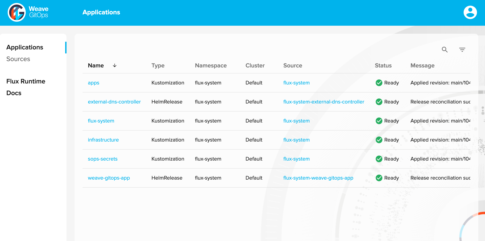
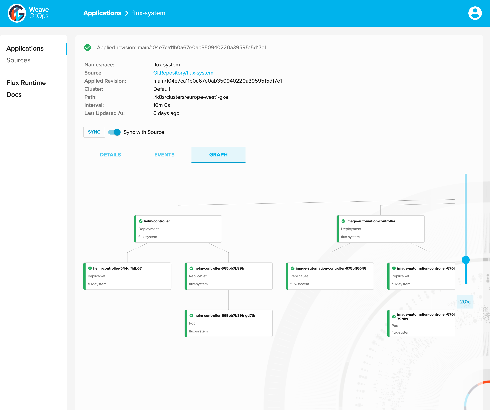
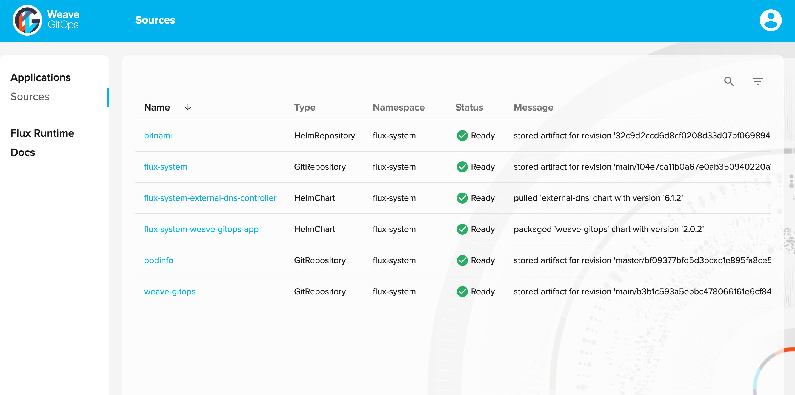
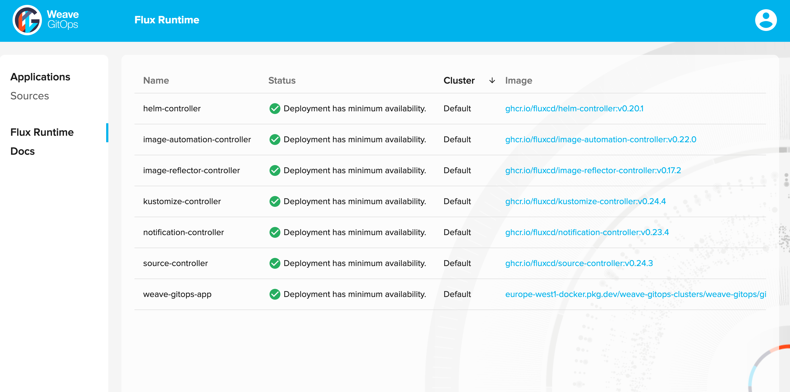

# Weave GitOps


[](https://github.com/weaveworks/weave-gitops/blob/master/LICENSE)
[](https://github.com/weaveworks/weave-gitops/graphs/contributors)
[](https://github.com/weaveworks/weave-gitops/releases/latest)
[](https://app.fossa.com/reports/005da7c4-1f10-4889-9432-8b97c2084e41)

Weave GitOps is a simple open source developer platform for people who want cloud native applications, without needing Kubernetes expertise.  Experience how easy it is to enable GitOps and run your apps in a cluster. Use git to collaborate with team members making new deployments easy and secure.  Start with what developers need to run apps, and then easily extend to define and run your own enterprise platform.

From Kubernetes run Weave GitOps to get:

1. Application Operations: see the automations that are running your deployments 
2. Platforms: the easy way to have your own custom PaaS on cloud or on premise
3. Extensions: coordinate Kubernetes rollouts with eg. VMs, DBs and cloud services

Our vision is that all cloud native applications should be easy for developers, including operations which should be automated and secure.  Weave GitOps is a highly extensible tool to achieve this by placing Kubernetes and GitOps at the core and building a platform around that.

We use GitOps tools throughout.  Today Weave GitOps defaults are Flux, Kustomize, Helm, Sops and Kubernetes CAPI.  If you use Flux already then you can easily add Weave GitOps to create a platform management overlay.

### Manage and view applications all in one place


### Easily see your continuous deployments and what is being produced via GitOps


### Easily see your git repositories and helm charts


### Quickly see the health of your continous deployment runtime


## Getting Started

### CLI Installation

Mac / Linux

```console
curl --silent --location "https://github.com/weaveworks/weave-gitops/releases/download/v0.8.0/gitops-$(uname)-$(uname -m).tar.gz" | tar xz -C /tmp
sudo mv /tmp/gitops /usr/local/bin
gitops version
```

Alternatively, users can use Homebrew:

```console
brew tap weaveworks/tap
brew install weaveworks/tap/gitops
```

Please see the [getting started guide](https://docs.gitops.weave.works/docs/getting-started).

## CLI Reference

```console
Command line utility for managing Kubernetes applications via GitOps.

Usage:
  gitops [command]

Examples:

  # Get verbose output for any gitops command
  gitops [command] -v, --verbose

  # Get help for gitops add cluster command
  gitops add cluster -h
  gitops help add cluster

  # Get the version of gitops along with commit, branch, and flux version
  gitops version

  To learn more, you can find our documentation at https://docs.gitops.weave.works/


Available Commands:
  add         Add a new Weave GitOps resource
  check       Validates flux compatibility
  completion  Generate the autocompletion script for the specified shell
  delete      Delete one or many Weave GitOps resources
  get         Display one or many Weave GitOps resources
  help        Help about any command
  update      Update a Weave GitOps resource
  upgrade     Upgrade to Weave GitOps Enterprise
  version     Display gitops version

Flags:
  -e, --endpoint string            The Weave GitOps Enterprise HTTP API endpoint
  -h, --help                       help for gitops
      --insecure-skip-tls-verify   If true, the server's certificate will not be checked for validity. This will make your HTTPS connections insecure
      --namespace string           The namespace scope for this operation (default "flux-system")
  -v, --verbose                    Enable verbose output

Use "gitops [command] --help" for more information about a command.
```

For more information please see the [docs](https://docs.gitops.weave.works/docs/cli-reference/gitops)


## FAQ

Please see our Weave GitOps Core [FAQ](https://www.weave.works/faqs-for-weave-gitops-core/)

## Contribution

Need help or want to contribute? Please see the links below.

- Getting Started?
  - Follow our [Get Started guide](https://docs.gitops.weave.works/docs/getting-started) and give us feedback
- Need help?
  - Talk to us in the [#weave-gitops channel](https://app.slack.com/client/T2NDH1D9D/C0248LVC719/thread/C2ND76PAA-1621532937.019800) on Weaveworks Community Slack. [Invite yourself if you haven't joined yet.](https://slack.weave.works/)
- Have feature proposals or want to contribute?
  - Please create a [Github issue](https://github.com/weaveworks/weave-gitops/issues)

## License scan details

[](https://app.fossa.com/reports/005da7c4-1f10-4889-9432-8b97c2084e41)
