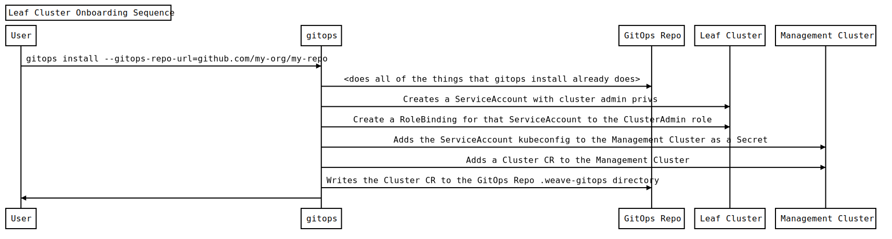
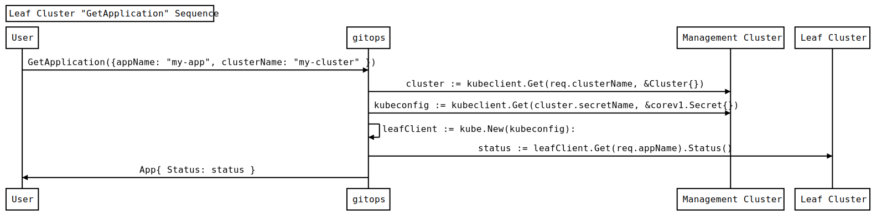

# 10. Leaf Cluster Kubernetes API Authentication

Date: 2021-11-16

## Status

Accepted

## Context

When a user "onboards" a new Leaf Cluster, we need ensure that the Weave GitOps API deployment running on the Management Cluster can query data about the objects on the Leaf Cluster. At present, we would have to rely on the user's local `kubeconfig` to provide all necessary authentication credentials to query multiple clusters at once.

This approach won't work for most use cases, as we cannot expect every user of the WeGO UI (and subsequently API) to have access or authorization to view objects on all clusters.

## Design

To allow a user to query data about a Leaf Cluster, we must do (roughly) these steps during the "onboarding" CLI command:

1. Create a `ServiceAccount` on the Leaf Cluster with cluster admin priveleges
2. Add the `kubeconfig` for that `ServiceAccount` as a `Secret` on the Management Cluster.
3. Add a `Cluster` Custom Resource to the Management Cluster to persist the `Cluster` record for future retreival

**Assumptions**:

- The user doing `gitops install` is a cluster admin and can create a cluster admin `ServiceAccount`

#### Leaf Cluster Sequence Diagrams

Here are the steps that need to happen during the Leaf Cluster onboarding.

Then, when a user makes a request to the UI(+API) running on the Management Cluster, it looks like this (written as psuedo-code):

#### RBAC

Access to the Leaf Clusters and Applications will be controlled by setting permissions on the individual `Cluster` and `Application` resources themselves. Users will use the existing Kubernetes RBAC machinery to manage these permissions.

## Consequences

### Change from the current SQLite DB to Cluster CR

This design will involve removing our current reliance on an SQLite database that is used to store data about the clusters. Instead of an SQL database, we will be relying on `Cluster` custom resources to be present in the Management Cluster's `etcd` database and subsequently served via the Management Cluster's Kubernetes API server.

For example, a list of all Leaf Clusters can be obtained by doing a `.List()` operation using a Kubernetes client instance
