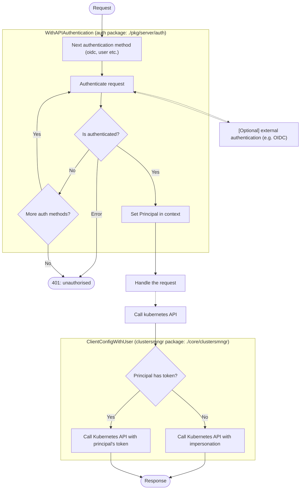

# 0015. A description of the current API authentication strategy

## Status

Accepted

This supersedes [ADR-0005 Wego Core Auth Strategy](./0005-wego-core-auth-strategy.md).

## Problem

We have no documentation around how authentication works in Weave Gitops. This will aim to capture the current state of
the system.

The 'decision' section has been skipped as the decisions have been made and reverse-engineering the rationale for them is unlikely to work. The 'context' section covers implementation details and the 'consequences' aims to enumerate major risks with the system as well as how to work with it safely.

## Glossary

* **Principal** an entity that is interacting with a system, this may be a user or an automated system
* **Authentication (AKA auth, authN)** the process of verifying who a principal is
* **Authorization (AKA authZ)** the process of determining what actions a principal is permitted to carry out (this is out of scope of this document)
* **OIDC** [OpenID Connect](https://docs.gitops.weave.works/docs/configuration/securing-access-to-the-dashboard/), a protocol that allows third-parties to authenticate end-users to an application
* **BearerToken** A token that allows direct authentication with the kubernetes API, used in the token-passthrough authentication method

## Context

**Note:** throughout this I refer to "auth methods" and "methods" which, for the sake of this document, mean the general process of authenticating who a request is coming from NOT the specific object method which may be called. 

This ADR deals with [autheNtication, not authoriZation](https://www.cloudflare.com/en-gb/learning/access-management/authn-vs-authz/), responsibility for authZ is handed off to Kubernetes.

Since ADR-0005 was accepted there have been several changes to Weave GitOps. The largest of these has been the removal of support for making changes to git repositories and a greater use of `impersonation` for authentication to the Kubernetes API.

ADR-0005 lists 3 authN/Z 'back ends':
* The Git repo (e.g. weave-gitops)
* The Git host (e.g. Github)
* Kubernetes

Since that ADR was written Weave Gitops no longer deals with authentication to either the Git repo or the Git host (although Weave Gitops Enterprise still does), so we'll ignore those concerns here. We do need to add a fourth concern though: authentication to the Weave Gitops server itself, authZ can be ignored for this as well as it depends upon Kubernetes to implement those controls.

These changes to concerns leaves us with authentication split over two parts:
* Authentication to the server -- this controls who can access the weave-gitops UI
* Authentication from the server to Kubernetes -- this deals with how authentication details are passed to the Kubernetes API to retrieve data.

The relationship between these two parts and their key components is given here and described below:



### Authentication to the server

Currently there are 3 supported methods:

* [OIDC (via header and cookie)](https://docs.gitops.weave.works/docs/configuration/service-account-permissions/)
* [Cluster user account](https://docs.gitops.weave.works/docs/configuration/service-account-permissions/)
* Token passthrough -- this is only used as part of enterprise installations.

methods must implement the `PrincipalGetter` interface which returns a `UserPrincipal`:
```go
type PrincipalGetter interface {
  Principal(r *http.Request) (*UserPrincipal, error)
}

type UserPrincipal struct {
  ID     string   `json:"id"`
  Groups []string `json:"groups"`
  Token  string   `json:"-"`
}
```

The `PrincipalGetter` is used by the `WithAPIAuthentication` middleware (part of the the [auth package](../../pkg/server/auth/auth.go)) that authenticates requests to the API. Auth methods are enabled via the `--auth-methods` flag. The methods are tested in the following order: cluster-user, token-passthrough then OIDC. The ordering is important as cluster-user and OIDC use the same name for their cookie (`id_token`) and OIDC will fail if given the cluster-user cookie. The middleware is used on all calls to the Gitops API that don't match one of the configured `PublicRoutes`. When a request is received it is passed to each enabled method's `Principal` function, the first call to return a non-nil response without erroring succeeds and no further methods are tested. If no methods succeed, or if a method returns an error, the request is rejected with a `401 (unauthorised)` status.

Configuration is primarily via the CLI but the OIDC method can also read configuration from a secret (by default `oidc-auth`) which over-rides CLI configuration. The `OIDC.TokenDuration` attribute is used to set all cookie expiry times (not just those related to OIDC).

It is important to note that the authentication method is also 'used' by the `/oauth2/userinfo` endpoint (handled by the [`login` method](../../pkg/server/auth/server.go). This endpoint searches cookies and headers to find principal information and returns it in an JSON object. This does not use the `PrincipalGetter` interface and discovers principal data independently.

### Authentication from the server to Kubernetes

The Gitops server's service account only needs a very limited set of permissions (`impersonate`, `get,list` on the secrets used to configure authentication and `get,list` on namespaces), the purpose of these permissions is covered in the [security docs](https://docs.gitops.weave.works/docs/configuration/service-account-permissions/). All interactions with the Kubernetes API should go via a `clustermngr` which will correctly set the Kubernetes client's impersonation configuration or bearer token (depending on the authentication method used).

The principal returned by `WithAPIAuthentication` is added to the request context to authenticate with the Kubernetes API. For OIDC and user-account methods the principal is extracted from the header or cookie token which is expected to have the following attributes:

```javascript
{
  "email": "someone@example.invalid",  // required
  "groups": ["team-a", "team-b"],      // optional
}
```

The `email` and `groups` terms are then used to configure [impersonation](https://kubernetes.io/docs/reference/access-authn-authz/authentication/#user-impersonation) to the Kubernetes API which allows the gitops' service account to act on the user's behalf.

When token-passthrough is used the user-supplied token is treated as a bearer token and no-impersonation is carried out. It is assumed that the Kubernetes API will know how to extract any relevant Principal information from it directly.

Communication to the Kubernetes API should be done via the client returned by `GetImpersonatedClient` (part of the [clustermngr package](../../core/clustermngr/clustermngr.go)) which will configure impersonation.

There are a couple of places in `pkg/server/auth/` and in `cmd/gitops-server/cmd/cmd.go` where a raw (i.e. non-impersonated) client are used, this is done to read secrets during initialisation and to call the `TokenReview` APIs that authenticate with pass-through tokens.

## Consequences

This is not an exhaustive list of consequences of the above but aims to capture important points.

The `PrincipalGetter` interface is very simple but is assumed to carry out authentication in addition to returning a `UserPrincipal`. The various implementations of `Principal` must be treated very carefully as they are the outermost layer of security against unauthenticated access to both Gitops and the Kubernetes API.

The order that authentication methods should be treated carefully, as should the name of cookies & headers being used to avoid problems with shadowing another methods' expected values.

If an empty `UserPrincipal` struct is passed to the `GetImpersonatedClient` then the client will throw an error. When returning a `UserPrincipal` authentication methods should make sure at least one of `ID` or `Token` is set.

There are no guarantees that the `Principal` returned by the `oauth2/userinfo` endpoint is actually the one that will be used to authenticate with the Kubernetes API as this endpoint uses its only function to retrieve principal information.

It is important to remember that the `impersonation` permission is very powerful and represents an easy route for privilege escalation (for example most Kubernetes clusters will have a `system:masters` group by default, that has full admin permissions). Care should be taken in Kubernetes verbs are used to limit the risk of poor configuration.

Similarly care should be taken in expanding the set of permissions granted to the service account so that the risk of un-authenticated use is minimised.
