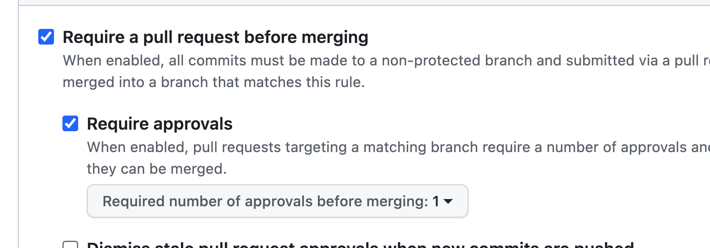
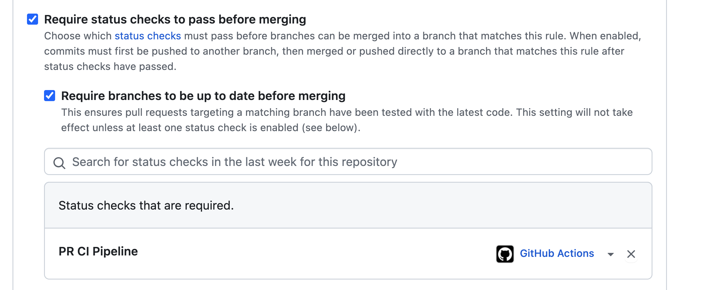
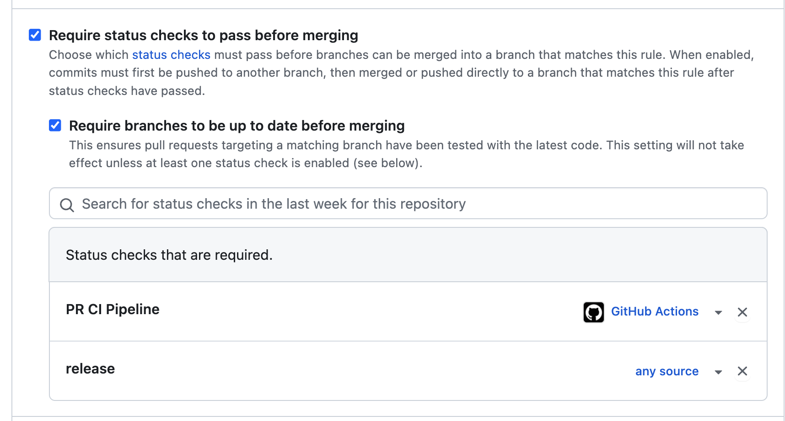
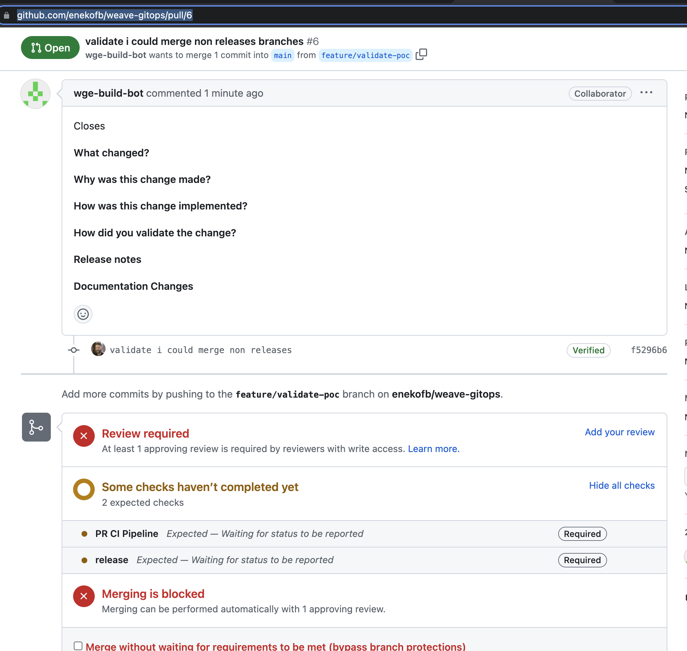
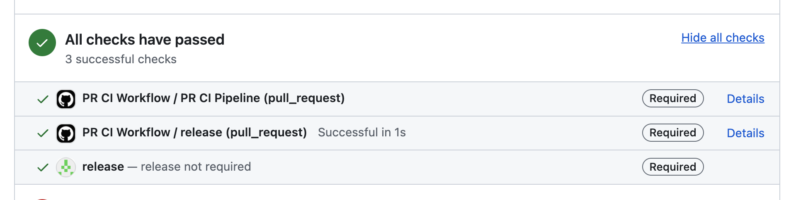
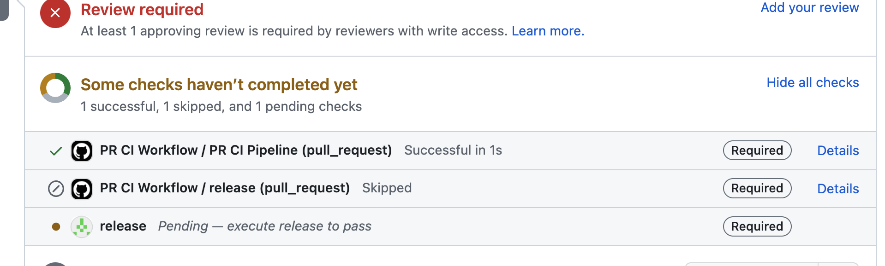
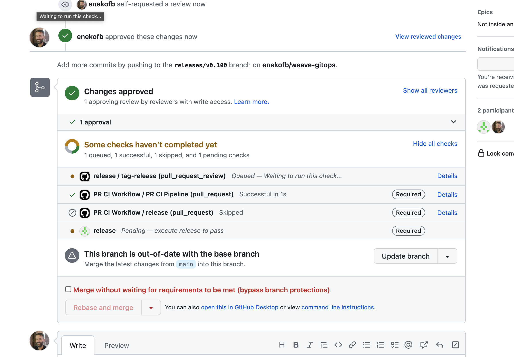
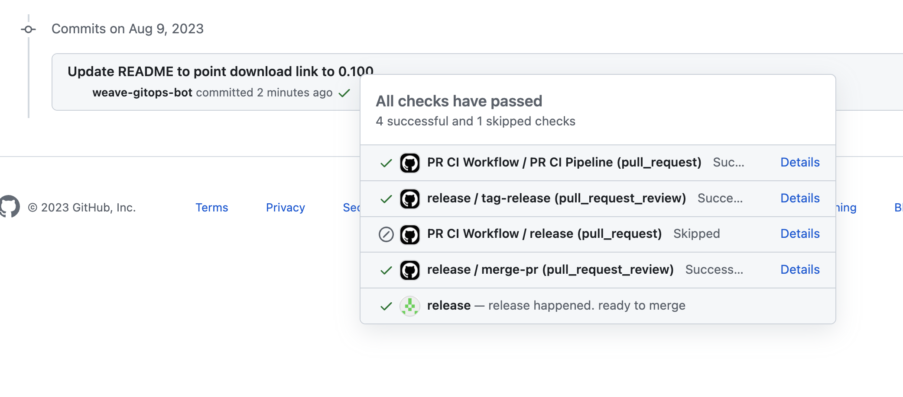

# Release v0.29 published helm chart before container image was available causing upgrade failures in users  

Tracking issue: https://github.com/weaveworks/weave-gitops/issues/3907

## Summary  

Wednesday, August 2nd, we released Weave Gitops v0.29 as part of our regular release cadence. The release published 
artefacts out of order causing degradation in users environments. For example as stated in the [issue](https://github.com/weaveworks/weave-gitops/issues/3907), 
the helm chart was published before the container image was available:

```
weave-gitops-648b7f9655-ll4zn   0/1     ImagePullBackOff   0          11m
weave-gitops-648b7f9655-ll4zn   0/1     ErrImagePull       0          11m
```

It was caused due to the release PR merged before the release workflows finished. It recovered when the release workflow finished 
and the container image was published. 

## Root Cause Analysis 

Releasing is stated in [release process](https://github.com/weaveworks/weave-gitops/blob/main/doc/release-process.md) that
requires two steps and workflows:
- [prepare-release](https://github.com/weaveworks/weave-gitops/blob/main/.github/workflows/prepare-release.yaml)
- [release](https://github.com/weaveworks/weave-gitops/blob/main/.github/workflows/release.yaml)

Looking at process and workflows, at least these two paths could cause the failures shown in the Background:

1. Release PR merged before Release job finishes
2. Release job steps [ordering](https://github.com/weaveworks/weave-gitops/blob/main/.github/workflows/release.yaml#L104-L107)

### Release PR merged before Release job finishes

Release PR has two expected interaction:
- Release PR is approved by Releaser flagging the release job to start. 
- Release PR is merged by Release Bot after the release job has completed. 

What the release process does not avoid, is Releaser accidentally merging the PR after approving and before the
release job has finished. 

This is the scenario that we found ourselves in the latest release [v0.29](https://github.com/weaveworks/weave-gitops/pull/3906). 
The merge triggered the [chart workflow](https://github.com/weaveworks/weave-gitops/blob/main/.github/workflows/chart.yaml) 
that [released v4.0.27 chart](https://github.com/weaveworks/weave-gitops/actions/runs/5738131386/job/15551116775). This chart  
expected [container image tag v0.29.0](https://github.com/weaveworks/weave-gitops/pull/3906/files#diff-67081178cf02ff87b1326e8b608a6ab4e49a85606346d64607b498fead04b048R13). 

This happened at around  `2023-08-02T11:16` (UTC is the timezone used here)

```bash
2023-08-02T11:16:18.4241737Z ##[group]Run helm push helm-release/weave-gitops-4.0.27.tgz oci://ghcr.io/weaveworks/charts
2023-08-02T11:16:18.4242301Z helm push helm-release/weave-gitops-4.0.27.tgz oci://ghcr.io/weaveworks/charts
2023-08-02T11:16:18.4298565Z shell: /usr/bin/bash -e {0}
2023-08-02T11:16:18.4298839Z env:
2023-08-02T11:16:18.4299087Z   REGISTRY: ghcr.io
2023-08-02T11:16:18.4299390Z   CHART_LOCATION: weaveworks/charts
2023-08-02T11:16:18.4299903Z   CLOUDSDK_AUTH_CREDENTIAL_FILE_OVERRIDE: /home/runner/work/weave-gitops/weave-gitops/gha-creds-4b2fc240e9fa929d.json
2023-08-02T11:16:18.4300541Z   GOOGLE_APPLICATION_CREDENTIALS: /home/runner/work/weave-gitops/weave-gitops/gha-creds-4b2fc240e9fa929d.json
2023-08-02T11:16:18.4301139Z   GOOGLE_GHA_CREDS_PATH: /home/runner/work/weave-gitops/weave-gitops/gha-creds-4b2fc240e9fa929d.json
2023-08-02T11:16:18.4301620Z   CLOUDSDK_CORE_PROJECT: docs-gitops-ww-prod
2023-08-02T11:16:18.4301972Z   CLOUDSDK_PROJECT: docs-gitops-ww-prod
2023-08-02T11:16:18.4302382Z   GCLOUD_PROJECT: docs-gitops-ww-prod
2023-08-02T11:16:18.4302728Z   GCP_PROJECT: docs-gitops-ww-prod
2023-08-02T11:16:18.4303069Z   GOOGLE_CLOUD_PROJECT: docs-gitops-ww-prod
2023-08-02T11:16:18.4303393Z ##[endgroup]
2023-08-02T11:16:19.8473627Z Pushed: ghcr.io/weaveworks/charts/weave-gitops:4.0.27
2023-08-02T11:16:19.8474536Z Digest: sha256:014965fae24719c62faf864c6748f6c24437c6fc437d0920131765a78ca91650
2023-08-02T11:16:19.8550603Z Post job cleanup.
```

First time we were notified of impact was at [11.26 UTC](https://weaveworks.slack.com/archives/CMDJFD3P0/p1690975563096289).

The container image tag v0.29.0 [started building](https://github.com/weaveworks/weave-gitops/actions/runs/5738127454) at `2023-08-02T11:29`: 

```
2023-08-02T11:29:24.0894265Z ##[group]Run docker/build-push-action@v3
2023-08-02T11:29:24.0894501Z with:
2023-08-02T11:29:24.0894681Z   context: .
2023-08-02T11:29:24.0894896Z   platforms: linux/amd64,linux/arm64
2023-08-02T11:29:24.0895102Z   push: true
2023-08-02T11:29:24.0895449Z   tags: ghcr.io/weaveworks/wego-app:0.29.0
ghcr.io/weaveworks/wego-app:v0.29.0
ghcr.io/weaveworks/wego-app:latest
```

And ended up at around `2023-08-02T12:41` 
```
023-08-02T12:40:58.9623639Z #70 pushing layers
2023-08-02T12:41:00.6152315Z #70 pushing layers 1.7s done
2023-08-02T12:41:00.6153313Z #70 pushing manifest for ghcr.io/weaveworks/wego-app:0.29.0@sha256:a0d23c6429357d2bc037470acbe347e40bd0ee738cbe4b328656cead3330e394
2023-08-02T12:41:01.8178601Z #70 pushing manifest for ghcr.io/weaveworks/wego-app:0.29.0@sha256:a0d23c6429357d2bc037470acbe347e40bd0ee738cbe4b328656cead3330e394 1.2s done
2023-08-02T12:41:01.9367337Z #70 pushing layers 0.3s done
2023-08-02T12:41:01.9369527Z #70 pushing manifest for ghcr.io/weaveworks/wego-app:v0.29.0@sha256:a0d23c6429357d2bc037470acbe347e40bd0ee738cbe4b328656cead3330e394
2023-08-02T12:41:02.5391427Z #70 pushing manifest for ghcr.io/weaveworks/wego-app:v0.29.0@sha256:a0d23c6429357d2bc037470acbe347e40bd0ee738cbe4b328656cead3330e394 0.5s done
2023-08-02T12:41:02.8397930Z #70 pushing layers 0.2s done
2023-08-02T12:41:02.8398709Z #70 pushing manifest for ghcr.io/weaveworks/wego-app:latest@sha256:a0d23c6429357d2bc037470acbe347e40bd0ee738cbe4b328656cead3330e394
2023-08-02T12:41:03.2911496Z #70 pushing manifest for ghcr.io/weaveworks/wego-app:latest@sha256:a0d23c6429357d2bc037470acbe347e40bd0ee738cbe4b328656cead3330e394 0.5s done
2023-08-02T12:41:03.2911964Z #70 DONE 9.0s
20
```

Any upgrade to v0.29.0 from `2023-08-02T11:16` to `2023-08-02T12:41` ended up in failure. 

Given the evidences we could say with a degree of certainty that this was the cause of the incident. The rest of the document focuses on understanding 
remediation actions and next steps. Release job steps ordering will be evaluated as separate issue. 

## Resolution 

It was resolved after the release workflow ended and the container image was published.

## Prevention

Given that a Releaser just needs to verify the release looks fine before triggered. We should design it the process 
with that into consideration. Two alternatives are identified: 

1. no human intervention has effect or not possible after release PR is approved
2. no human intervention is required during the release process

From the two approaches, we will be giving priority to the first one, so the second would require changing the process that we could anticipate would
be more costly (more changes to do) and riskier (adopt new process and changes could end up in different new failure modes). 
The second alternative would be discovered in case there is no  feasible solution from 1) or there is no appetite to go ahead with that. 

### No human intervention has effect or not possible after release PR is approved
The scenario we want to model would be something like 

```gherkin
Feature: release with out of order guardrails  

  Scenario: 
    Given releaser executed prepare-release job with `v0.30`
    Then release PR is created 
    And release PR cannot be merged cause not approved
    And release PR cannot be merged cause not released
    
    When releaser approves it
    Then release workflow starts
    And release PR cannot be merged as not yet release workflow ended
    
    When release workflow ends
    Then release PR is merged by release bot 
```
A solution to achieve the semantics that only `approved and released` release PRs could be merged, could be achieved 
by extending our current `branch merge protection`: 

Protection against merging unapproved PRs is already in place.



Protection against merging not-released PRs is not in place:  



We could add that layer of protection by leveraging [github status checks](https://docs.github.com/en/pull-requests/collaborating-with-pull-requests/collaborating-on-repositories-with-code-quality-features/about-status-checks)
and requiring a `release` status check to merge PRs:



A `release` status checks would have locking semantics as follows: 
- Do nothing if the PR is not from a release branch. 
- if release branch
  - `lock`: at prepare-release workflow.
  - `unlock`: after release has been done (and container image has been published).

Therefore, an attempt to merge a release PR would be blocked until the release does not happen. 

The `release` status check could be managed via github api and gitihub actions steps like:

```yaml 
  release:
    if: ${{ !startsWith(github.event.pull_request.head.ref, 'releases/') }}
    runs-on: ubuntu-latest
    steps:
      - name: release
        run: |
          curl --request POST \
            --url https://api.github.com/repos/${{ github.repository }}/statuses/${{ github.event.pull_request.head.sha }} \
            --header 'authorization: Bearer ${{ secrets.WEAVE_GITOPS_BOT_ACCESS_TOKEN }}' \
            --header 'content-type: application/json' \
            --data '{
                "state":"success",
                "description":"release not required",
                "context":"release"
              }'
```

### Proof of Concept Validation 

#### Non-Release Branch Scenario 

```gherkin
Feature: can build non-release branches without changing the flow nor overhead
  Background: 
    Given weave-gitops main merges are protected with `build` status check
    And weave-gitops main merges are protected with `release` status check
    
  Scenario: current flow  
    Given a non release pr
    When build
    Then CI workflow  passes
    And I could merge
```


```
  Background: 
    Given weave-gitops main merges are protected with `build` status check
    And weave-gitops main merges are protected with `release` status check

```


```
   Given a non release pr
    When build
 
```
Created branch called `feature/validation-poc` and Bot raised PR https://github.com/enekofb/weave-gitops/pull/6

Where we could see the checks pending



Action building https://github.com/enekofb/weave-gitops/actions/runs/5806346911

After building, it gets updated



I could approve and merge as usual https://github.com/enekofb/weave-gitops/pull/6

#### Release Branch Scenario

```gherkin
Feature: can build release branches with guardrails

  Background:
    Given weave-gitops main merges are protected with `build` status check
    And weave-gitops main merges are protected with `release` status check

  Scenario: add a check to the PR that only gets passed when release goes on
    When human executed prepare-release job with `v0.30`
    Then release PR is created 
    And release PR cannot be merged cause not approved
    And release PR cannot be merged cause not release build passes

    When human approves it
    Then release process starts
    And cannot merge it cause release hasnt happened

    When release process ends 
    Then release check passes
    And release branch is merged by bot
```


```
    Given human executed prepare-release job with `v0.100`
```


https://github.com/enekofb/weave-gitops/actions/runs/5806576714

```
    Then release PR is created 
    And release PR cannot be merged cause not approved
    And release PR cannot be merged cause not release build passes
```

https://github.com/enekofb/weave-gitops/pull/11

We could see how `release Pending — execute release to pass`



```
    When human approves it
    Then release process starts
    And cannot merge it cause release hasnt happened
```

Release has started https://github.com/enekofb/weave-gitops/actions/runs/5806793749/job/15740396733 

And cannot merge it 



```
    When release process ends 
    Then release check passes
    And release branch is merged by bot
```
After the release happened, the PR got merged by the bot 



https://github.com/enekofb/weave-gitops/actions/runs/5806793749/job/15740396733
```
{
  "sha": "03093a127262cad8f4c94caf8aa4262314a1cedd",
  "merged": true,
  "message": "Pull Request successfully merged"
}
```

## Known Limitations 

- Failure handling for the approach 
