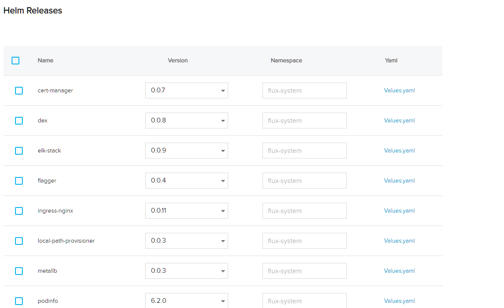

# Cluster Management Introduction ~ENTERPRISE~

In line with the mantra “cattle, not pets,” Weave GitOps Enterprise (WGE) simplifies managing cluster lifecycle at scale—even massive scale. Through pull requests, which make every action recorded and auditable, WGE makes it possible for teams to create, update, and delete clusters across entire fleets. Breaking things is harder, and recovery is easier. WGE further simplifies the cluster lifecycle management process by providing both a user interface (UI) and a command line interface (CLI) to interact with and manage clusters on-prem, across clouds, and in hybrid environments. You can even use our UI to delete clusters—all it takes is the press of a button that spins up a pull request.

WGE fully supports a range of options, including:
- [Crossplane integration](https://www.weave.works/blog/gitops-goes-beyond-kubernetes-with-weave-gitops-upbound-s-universal-crossplane)
- Terraform integration, with a [Terraform Controller](https://docs.gitops.weave.works/docs/terraform/overview/) that follows the patterns established by Flux
- [Cluster API](https://cluster-api.sigs.k8s.io/)

## Helm Charts and Kustomizations Made Easy with Our UI

The Weave GitOps Enterprise UI enables you to install software packages to your bootstrapped cluster via the Applications view of our user interface, using a [Helm chart](https://www.weave.works/blog/helm-charts-in-kubernetes) (via a HelmRelease) or [Kustomization](https://fluxcd.io/flux/components/kustomize/kustomization/). First, find the "Add an Application" button:

A form will appear, asking you to select the target cluster where you want to add your Application.

Select the source type of either your Git repository or your Helm repository from the selected cluster:

If you select Git repository as the source type, you will be able to add the Application from Kustomization:

If you select Helm repository as the source type, you will be able to add Application from HelmRelease. 

And if you choose the profiles Helm chart repository URL, you can select a profile from our [Profiles](profiles.md) list.

Finally, you can create a pull request to your target cluster and see it on your GitOps repository.

## Follow Our User Guide

Our user guide provides two pathways to deployment:

- One path that shows you how to manage clusters [without adding Cluster API](managing-clusters-without-capi.md). Join a cluster by hooking WGE to it, then install an application on that cluster.
- An **optional** path that shows you how to create, provision, and delete your first API cluster with [EKS/CAPA](../cluster-management/deploying-capa-eks.md).

Just click the option you want to get started with, and let's go.
