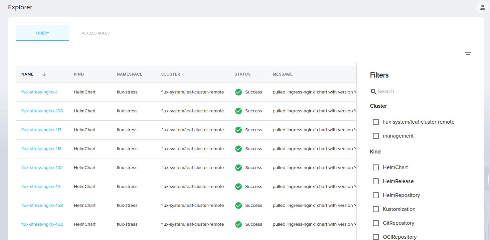

# Getting started  ~ENTERPRISE~

!!! warning
    **This feature is in alpha and certain aspects will change**
    We're very excited for people to use this feature.
    However, please note that changes in the API, behaviour and security will evolve.
    The feature is suitable to use in controlled testing environments.

This guide shows you the basics steps to start using Explorer.

## Pre-requisites

Before using Explorer, please ensure that:

- You have Weave Gitops Enterprise [v0.23.0 or later version](../enterprise/releases-enterprise.md)
- You have deployed an application.

## Setup

Explorer is enabled via configuration through the feature flag  `explorer.enabled` that you could
configure in your Weave Gitops Enterprise HelmRelease values:


```yaml
---
apiVersion: helm.toolkit.fluxcd.io/v2beta1
kind: HelmRelease
metadata:
  name: weave-gitops-enterprise
  namespace: flux-system
spec:
  # ... other spec components
  values:
  explorer:
    enabled: true # global enable/disable flag
    collector:
      # ServiceAccount that explorer will use to watch clusters for resources
      serviceAccount:
        name: "collector"
        namespace: "flux-system"
    cleaner:
      disabled: false
    enabledFor: # controls which parts of the UI utilize the Explorer UI/Server components
      - applications
      - sources
      - gitopssets
      - templates
```

The `enabledFor` field will control which parts of the UI utilize the Explorer backend for performant queries. Note that this does not control the collection of these objects, only the presentation of the objects in the UI.

For a complete overview on the configuration you could see [configuration](./configuration.md).

## Explorer UI

Login to Weave Gitops and Explorer will be shown in the navigation menu `Explorer`.

Explorer UI looks as follows:



It has two main components:

- A search dialog with filter to querying the platform resources
- A table with the filtered resources.

For a more detailed view on the UI you could see [querying](./querying.md).
