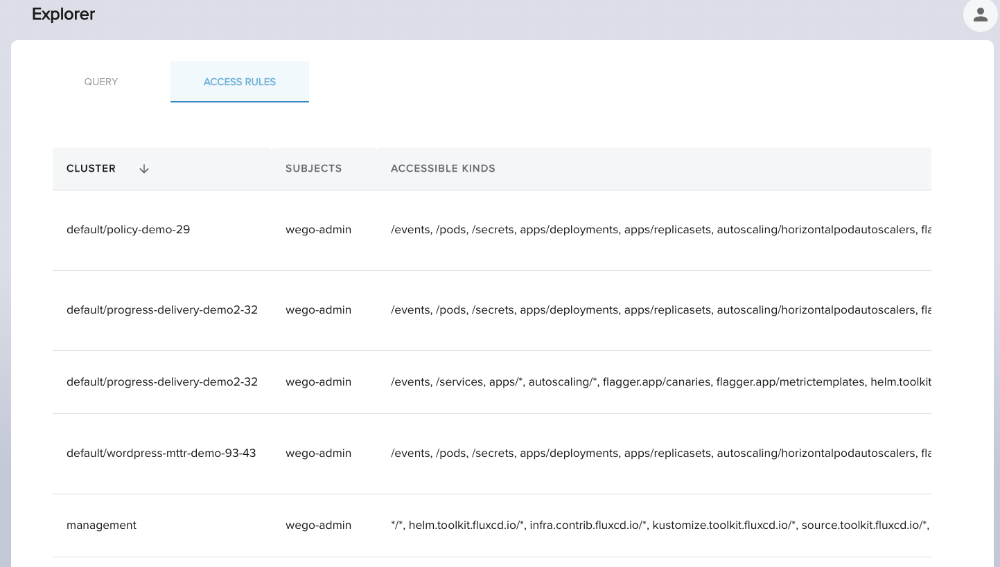
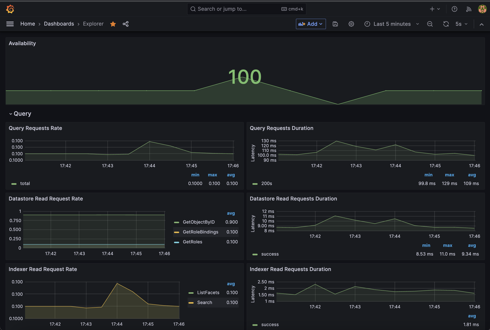

# Operations ~ENTERPRISE~

!!! warning
    **This feature is in alpha and certain aspects will change**
    We're very excited for people to use this feature.
    However, please note that changes in the API, behaviour and security will evolve.
    The feature is suitable to use in controlled testing environments.

As platform engineer you could need to have a finer understanding on the underlying logic for Explorer. The following
options are available to you to operate and troubleshoot it.

## Debug Access Rules

It is a debugging tool to make visible explorer authorization logic. You could find it as tab `Access Rules`  alongside
the `Query` tab.



You could discover by `Cluster` and `Subject` the `Kinds` it is allowed to read. These are the rules that
will be the source of truth doing authorization when a user does a query.

## Monitoring

Explorer provides the following telemetry to use for operations.

### Metrics

Explorer exports [Prometheus](https://prometheus.io/) metrics. See [setup](../../operations/monitoring#setup) to get started.

#### Querying

Explorer querying path is composed of three components exporting metrics:

- API server
- Datastore Reads
- Indexer Reads

##### API Server

Based on [go-http-metrics](https://github.com/slok/go-http-metrics/blob/master/metrics/prometheus/prometheus.go), the following
metrics are generated.

**Request Duration:** histogram with the latency of the HTTP requests.

```
http_request_duration_seconds_bucket{handler="/v1/query",method="POST",le="0.05"} 0
http_request_duration_seconds_sum{handler="/v1/query",method="POST"} 10.088081923
http_request_duration_seconds_count{handler="/v1/query",method="POST"} 51
```

**Response Size:** histogram with the size of the HTTP responses in bytes

```
http_response_size_bytes_bucket{handler="/v1/query",method="POST",le="0.05"} 10
http_response_size_bytes_sum{handler="/v1/query",method="POST"} 120
http_response_size_bytes_count{handler="/v1/query",method="POST"} 10
```

**Requests In Flight:** gauge with the number of inflight requests being handled at the same time.

```
http_requests_inflight{handler="/v1/query"} 0
```

##### Datastore Reads

**Request Latency:** histogram with the latency of the datastore read requests.

- `action` is the datastore read operation that could be either `GetObjects`, `GetAccessRules`, `GetObjectByID`, `GetRoles` or `GetRoleBindings`.
- `status` is the result of the operation. It could be either  read operation that could be either `success` or `error`.

```
datastore_latency_seconds_bucket{action="GetObjectByID", le="+Inf", status="success"} 1175
datastore_latency_seconds_bucket{action="GetObjectByID", le="0.01", status="success"} 1174
```
```
datastore_latency_seconds_count{action="GetObjectByID",  status="success"} 1175
datastore_latency_seconds_count{action="GetRoleBindings",  status="success"} 47
datastore_latency_seconds_count{action="GetRoles",  status="success"} 47
```
```
datastore_latency_seconds_sum{action="GetObjectByID",  status="success"} 0.6924557999999995
datastore_latency_seconds_sum{action="GetRoleBindings",  status="success"} 1.329158916
datastore_latency_seconds_sum{action="GetRoles",  status="success"} 3.942473879999999
```

**Requests In Flight:** gauge with the number of inflight requests being handled at the same time.

- `action` is the datastore read operation that could be either `GetObjects`, `GetAccessRules`, `GetObjectByID`, `GetRoles` or `GetRoleBindings`

```
datastore_inflight_requests{action="GetObjectByID"} 0
datastore_inflight_requests{action="GetRoleBindings"} 0
datastore_inflight_requests{action="GetRoles"} 0
```

##### Indexer Reads

**Request Latency:** histogram with the latency of the indexer read requests.

- `action` is the index read operation that could be either `ListFacets` or `Search`
- `status` is the result of the operation. It could be either  read operation that could be either `success` or `error`

```
indexer_latency_seconds_bucket{action="ListFacets", le="+Inf", status="success"} 1
indexer_latency_seconds_bucket{action="Search", le="+Inf", status="success"} 47
```
```
indexer_latency_seconds_sum{action="ListFacets", status="success"} 0.008928666
indexer_latency_seconds_sum{action="Search", status="success"} 0.06231312599999999
```
```
indexer_latency_seconds_count{action="ListFacets", status="success"} 1
indexer_latency_seconds_count{action="Search", status="success"} 47
```

**Requests In Flight:** gauge with the number of inflight requests being handled at the same time.

- `action` is the index read operation that could be either `ListFacets` or `Search`

```
indexer_inflight_requests{action="ListFacets"} 0
indexer_inflight_requests{action="Search"} 0
```

#### Collecting

Explorer collecting path is composed of three components exporting metrics:

- Cluster Watcher Manager
- Datastore Writes
- Indexer Writes

The following metrics are available to monitor its health.

##### Cluster Watcher

The metric `collector_cluster_watcher` provides the number of the cluster watchers it the following `status`:
- Starting: a cluster watcher is starting at the back of detecting that a new cluster has been registered.
- Started: cluster watcher has been started and collecting events from the remote cluster. This is the stable state.
- Stopping: a cluster has been deregistered so its cluster watcher is no longer required. In the process of stopping it.
- Failed: a cluster watcher has failed during the creation or starting process and cannot collect events from the remote clusters. This is the unstable state.

Where `collector` is the type of collector, it could be
- rbac: for collecting RBAC resources (ie roles)
- objects: for collecting non-rbac resources (ie kustomizations)

```
collector_cluster_watcher{collector="objects", status="started"} 1
collector_cluster_watcher{collector="objects", status="starting"} 0
collector_cluster_watcher{collector="rbac", status="started"} 1
collector_cluster_watcher{collector="rbac", status="starting"} 0
```

A sum on `collector_cluster_watcher` gives the total number of cluster watchers that should be equal to the number of clusters

##### Datastore Writes

**Request Latency:** histogram with the latency of the datastore write requests.

- `action` is the datastore write operation that could be either `StoreRoles`, `StoreRoleBindings`, `StoreObjects`, `DeleteObjects`,
`DeleteAllObjects`, `DeleteRoles`, `DeleteAllRoles`, `DeleteRoleBindings`, `DeleteAllRoleBindings`
- `status` is the result of the operation. It could be either  read operation that could be either `success` or `error`

```
datastore_latency_seconds_bucket{action="StoreRoles", le="+Inf", status="success"} 1175
datastore_latency_seconds_bucket{action="StoreRoles", le="0.01", status="success"} 1174
```

```
datastore_latency_seconds_count{action="StoreRoles",  status="success"} 1175
datastore_latency_seconds_count{action="DeleteRoles",  status="success"} 47
datastore_latency_seconds_count{action="DeleteAllRoleBindings",  status="success"} 47
```

```
datastore_latency_seconds_sum{action="StoreRoles",  status="success"} 0.6924557999999995
datastore_latency_seconds_sum{action="DeleteRoles",  status="success"} 1.329158916
datastore_latency_seconds_sum{action="DeleteAllRoleBindings",  status="success"} 3.942473879999999
```

**Requests In Flight:** gauge with the number of inflight write requests being handled at the same time.

- `action` is the datastore write operation that could be either `StoreRoles`, `StoreRoleBindings`, `StoreObjects`, `DeleteObjects`,
`DeleteAllObjects`, `DeleteRoles`, `DeleteAllRoles`, `DeleteRoleBindings`, `DeleteAllRoleBindings`

```
datastore_inflight_requests{action="StoreRoles"} 0
datastore_inflight_requests{action="StoreRoleBindings"} 0
datastore_inflight_requests{action="DeleteAllRoleBindings"} 0
```

##### Indexer Writes

**Request Latency:** histogram with the latency of the indexer write requests.

- `action` is the index write operation that could be either `Add`, `Remove` or `RemoveByQuery`
- `status` is the result of the operation. It could be either `success` or `error`

```
indexer_latency_seconds_bucket{action="Add",status="success",le="+Inf"} 109
indexer_latency_seconds_bucket{action="Remove",status="success",le="+Inf"} 3
```
```
indexer_latency_seconds_sum{action="Add",status="success"} 8.393912168
indexer_latency_seconds_sum{action="Remove",status="success"} 0.012298476
```
```
indexer_latency_seconds_count{action="Add",status="success"} 109
indexer_latency_seconds_count{action="Remove",status="success"} 3
```

**Requests In Flight:** gauge with the number of inflight requests being handled at the same time.

- `action` is the index write operation that could be either `Add`, `Remove` or `RemoveByQuery`

```
indexer_inflight_requests{action="Add"} 0
indexer_inflight_requests{action="Remove"} 0
```

### Dashboard

Use Explorer dashboard to monitor its [golden signals](https://sre.google/sre-book/monitoring-distributed-systems/#xref_monitoring_golden-signals)



Explorer dashboard is part of [Weave GitOps Dashboards](../../operations/monitoring#dashboards)