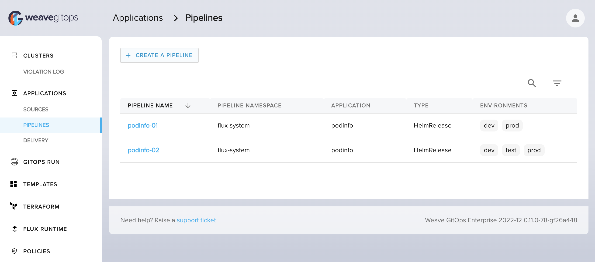
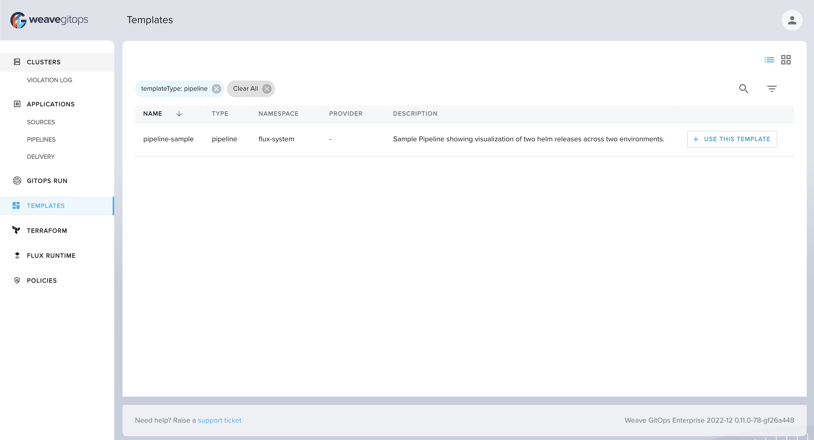

# Using GitOpsTemplates for Pipelines ~ENTERPRISE~

To create new Pipelines and their required resources from within Weave GitOps
Enterprise, you can leverage [GitOpsTemplates](../gitops-templates/index.md), which help platform teams scale for developer self-service.

This document provides example configuration that you can adapt and use within your own organization, based on your [tenancy model](https://kubernetes.io/blog/2021/04/15/three-tenancy-models-for-kubernetes/).

We will cover the creation of:

- Pipelines
- Alerts
- Providers

Secrets, required for authentication and authorization between leaf and management clusters as well as to Git, are out of scope for this document and must be handled by your chosen secret management solution.

For advice on Secrets Management, refer to [the Flux guide](https://fluxcd.io/flux/security/secrets-management/).

Templates can include a single resource or multiple resources, depending on your use case. For example, you may want to only create the Pipeline custom resource to associate existing HelmReleases. Or, you can create the HelmReleases, notification controller resources, and Pipeline all in a single template. They are highly customizable to meet the needs of your teams.

## Adding New Resources From Within the Weave GitOps Enterprise Dashboard

GitOpsTemplates are custom resources installed onto a management cluster where Weave GitOps Enterprise resides. To add a new Pipeline, click `Create a Pipeline` from within the Pipeline view. This will take you to a pre-filtered list of templates with the label: `weave.works/template-type: pipeline`.



 The `Templates` view (shown below) lists all templates for which a given user has the appropriate permission to view. You can install GitOpsTemplates into different namespaces and apply standard Kubernetes RBAC to limit which teams can utilize which templates. You can also configure [policy](../../policy/intro) to enforce permitted values within a template.



## Example: GitOpsTemplates

This section provides examples to help you build your own templates for Pipelines.

### Pipeline: Visualization Only

!!! tip "Included Sample"
    This default template is shipped with Weave GitOps Enterprise to help you get started with Pipelines.

For flexibility, this allows the template user to specify the names of the clusters where the application is deployed, and to vary the namespace per cluster. This works even in a tenancy model where environments coexist on the same cluster and use namespaces for isolation.

??? example "Expand to view example template"

    ```yaml
    ---
    apiVersion: templates.weave.works/v1alpha2
    kind: GitOpsTemplate
    metadata:
    name: pipeline-sample
    namespace: default # Namespace where the GitOpsTemplate is installed, consider that a team will need READ access to this namespace and the custom resource
    labels:
        weave.works/template-type: pipeline
    spec:
    description: Sample Pipeline showing visualization of two helm releases across two environments.
    params:
        - name: RESOURCE_NAME # This is a required parameter name to enable Weave GitOps to write to your Git Repository
        description: Name of the Pipeline
        - name: RESOURCE_NAMESPACE
        description: Namespace for the Pipeline on the management cluster
        default: flux-system # default values make it easier for users to fill in a template
        - name: FIRST_CLUSTER_NAME
        description: Name of GitopsCluster object for the first environment
        - name: FIRST_CLUSTER_NAMESPACE
        description: Namespace where this object exists
        default: default
        - name: FIRST_APPLICATION_NAME
        description: Name of the HelmRelease for your application in the first environment
        - name: FIRST_APPLICATION_NAMESPACE
        description: Namespace for this application
        default: flux-system
        - name: SECOND_CLUSTER_NAME
        description: Name of GitopsCluster object for the second environment
        - name: SECOND_CLUSTER_NAMESPACE
        description: Namespace where this object exists
        default: default
        - name: SECOND_APPLICATION_NAME
        description: Name of the HelmRelease for your application in the second environment
        - name: SECOND_APPLICATION_NAMESPACE
        description: Namespace for this application
        default: flux-system
    resourcetemplates:
        - content:
        - apiVersion: pipelines.weave.works/v1alpha1
            kind: Pipeline
            metadata:
            name: ${RESOURCE_NAME}
            namespace: ${RESOURCE_NAMESPACE}
            spec:
            appRef:
                apiVersion: helm.toolkit.fluxcd.io/v2beta1
                kind: HelmRelease
                name: ${APPLICATION_NAME}
            environments:
            - name: First-Environment
                targets:
                - namespace: ${FIRST_APPLICATION_NAMESPACE}
                    clusterRef:
                    kind: GitopsCluster
                    name: ${FIRST_CLUSTER_NAME}
                    namespace: ${FIRST_CLUSTER_NAMESPACE}
            - name: Second-Environment
                targets:
                - namespace: ${SECOND_APPLICATION_NAMESPACE}
                    clusterRef:
                    kind: GitopsCluster
                    name: ${SECOND_CLUSTER_NAME}
                    namespace: ${SECOND_CLUSTER_NAMESPACE}
    ```

### Pipeline - Multi-Cluster Promotion

This example extends the above to add a promotion strategy. In this case, it will raise a pull request to update the application version in subsequent environments.

??? example "Expand to view example template"

    ```yaml
    ---
    apiVersion: templates.weave.works/v1alpha2
    kind: GitOpsTemplate
    metadata:
    name: pipeline-sample
    namespace: default
    labels:
        weave.works/template-type: pipeline
    spec:
    description: Sample Pipeline showing visualization of two helm releases across two environments.
    params:
        - name: RESOURCE_NAME
        description: Name of the Pipeline
        - name: RESOURCE_NAMESPACE
        description: Namespace for the Pipeline on the management cluster
        default: flux-system
        - name: FIRST_CLUSTER_NAME
        description: Name of GitopsCluster object for the first environment
        - name: FIRST_CLUSTER_NAMESPACE
        description: Namespace where this object exists
        default: default
        - name: FIRST_APPLICATION_NAME
        description: Name of the HelmRelease for your application in the first environment
        - name: FIRST_APPLICATION_NAMESPACE
        description: Namespace for this application
        default: flux-system
        - name: SECOND_CLUSTER_NAME
        description: Name of GitopsCluster object for the second environment
        - name: SECOND_CLUSTER_NAMESPACE
        description: Namespace where this object exists
        default: default
        - name: SECOND_APPLICATION_NAME
        description: Name of the HelmRelease for your application in the second environment
        - name: SECOND_APPLICATION_NAMESPACE
        description: Namespace for this application
        default: flux-system
        - name: APPLICATION_REPO_URL
        description: URL for the git repository containing the HelmRelease objects
        - name: APPLICATION_REPO_BRANCH
        description: Branch to update with new version
        - name: GIT_CREDENTIALS_SECRET
        description: Name of the secret in RESOURCE_NAMESPACE containing credentials to create pull requests
    resourcetemplates:
        - content:
        - apiVersion: pipelines.weave.works/v1alpha1
            kind: Pipeline
            metadata:
            name: ${RESOURCE_NAME}
            namespace: ${RESOURCE_NAMESPACE}
            spec:
            appRef:
                apiVersion: helm.toolkit.fluxcd.io/v2beta1
                kind: HelmRelease
                name: ${APPLICATION_NAME}
            environments:
            - name: First-Environment
                targets:
                - namespace: ${FIRST_APPLICATION_NAMESPACE}
                    clusterRef:
                    kind: GitopsCluster
                    name: ${FIRST_CLUSTER_NAME}
                    namespace: ${FIRST_CLUSTER_NAMESPACE}
            - name: Second-Environment
                targets:
                - namespace: ${SECOND_APPLICATION_NAMESPACE}
                    clusterRef:
                    kind: GitopsCluster
                    name: ${SECOND_CLUSTER_NAME}
                    namespace: ${SECOND_CLUSTER_NAMESPACE}
            promotion:
                pull-request:
                    url: ${APPLICATION_REPO_URL}
                    baseBranch: ${APPLICATION_REPO_BRANCH}
                    secretRef:
                    name: ${GIT_CREDENTIALS_SECRET}
    ```

#### Git Credentials

For guidance on configuring credentials, find instructions in the [Promoting Applications](../promoting-applications#create-credentials-secret) documentation.

#### Promotion Marker Added to HelmRelease in `Second-Environment`

You must add a comment to the HelmRelease or Kustomization patch where the `spec.chart.spec.version` is defined. For example, if the values used in the above template were as follows:

```yaml
RESOURCE_NAME=my-app
RESOURCE_NAMESPACE=pipeline-01
```

Then the marker would be:

```yaml
# {"$promotion": "pipeline-01:my-app:Second-Environment"}
```

Find more guidance on adding markers [here](../promoting-applications#add-markers-to-app-manifests).

### Alerts and Providers

This example shows you how you can configure multiple resources in a single template and simplify creation through common naming strategies. The notification controller communicates update events from the leaf clusters where applications are deployed to the management cluster, where the Pipeline Controller resides and orchestrates.

For the `Alert`, this template filters events to detect when an update has occurred. Depending on your use case, you can use different filtering.

For the `Provider`, this template uses authenticated (HMAC) communication to the promotion endpoint, where a secret must be present on both the management cluster and the leaf cluster(s). For simplicity's sake, you can use a `generic` provider instead; this will not require the secret.

??? example "Expand to view example template"

    ```yaml
    ---
    apiVersion: templates.weave.works/v1alpha2
    kind: GitOpsTemplate
    metadata:
    name: pipeline-notification-resources
    namespace: default
    labels:
        weave.works/template-type: application # These are generic Flux resources rather than Pipeline-specific
    spec:
    description: Creates flux notification controller resources for a cluster, required for promoting applications via pipelines.
    params:
        - name: RESOURCE_NAME
        description: Name for the generated objects, should match the target Application (HelmRelease) name.
        - name: RESOURCE_NAMESPACE
        description: Namespace for the generated objects, should match the target Application (HelmRelease) namespace.
        - name: PROMOTION_HOST
        description: Host for the promotion webhook on the management cluster, i.e. "promotions.example.org"
        - name: SECRET_REF
        description: Name of the secret containing HMAC key in the token field
        - name: ENV_NAME
        description: Environment the cluster is a part of within a pipeline.
    resourcetemplates:
        - content:
        - apiVersion: notification.toolkit.fluxcd.io/v1beta1
            kind: Provider
            metadata:
            name: ${RESOURCE_NAME}
            namespace: ${RESOURCE_NAMESPACE}
            spec:
            address: http://${PROMOTION_HOST}/promotion/${APP_NAME}/${ENV_NAME}
            type: generic-hmac
            secretRef: ${SECRET_REF}
        - apiVersion: notification.toolkit.fluxcd.io/v1beta1
            kind: Alert
            metadata:
            name: ${RESOURCE_NAME}
            namespace: ${RESOURCE_NAMESPACE}
            spec:
            providerRef:
                name: ${RESOURCE_NAME}
            eventSeverity: info
            eventSources:
                - kind: HelmRelease
                name: ${RESOURCE_NAME}
            exclusionList:
                - ".*upgrade.*has.*started"
                - ".*is.*not.*ready"
                - "^Dependencies.*"
    ```
s
## Summary

GitOpsTemplates provide a highly flexible way for platform and application teams to work together with Pipelines.

You can hard-code values, offer a range of accepted values, or allow the template consumer to provide input based on your organization's requirements.

Templates are subject to RBAC as with any Kubernetes resource, enabling you to easily control which tenants have access to which templates.

For full details on GitOpsTemplates, read our [documentation](../gitops-templates/index.md).
