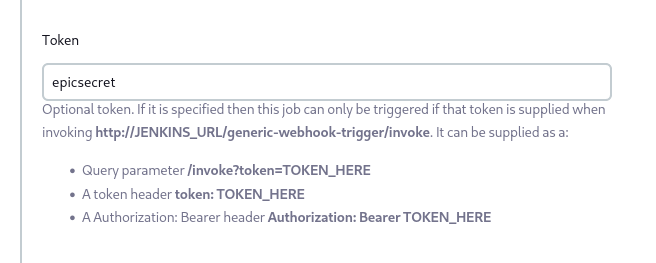
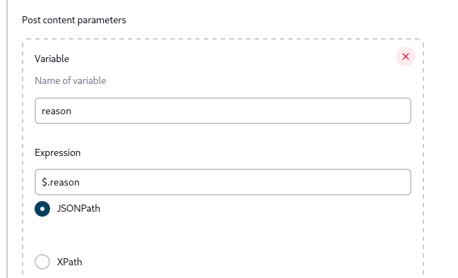

# Setting Up Pipelines to Notify a Jenkins Webhook ~ENTERPRISE~

Using Flux's [Notification
Controller](https://fluxcd.io/flux/components/notification/), a Jenkins Webhook
can be invoked on Pipeline promotion events.

## Configuring Jenkins

To enable external callers to trigger a build on a job, an additional ["Generic
Webhook Trigger" plugin](https://plugins.jenkins.io/generic-webhook-trigger/) is
required as Jenkins does not have this functionality built-in.

After the plugin is installed a new "Generic Webhook Trigger" job configuration
option is available.

The only mandatory field is the "Token". Without this token, Jenkins will not
know which build should be triggered.



### Post content parameters

To access fields from the pipeline event payload, each field has to be defined
as a "Post content parameters".



??? example " Expand to see an example Promotion Event payload"

    ```json
    {
    "involvedObject": {
        "kind": "Pipeline",
        "namespace": "flux-system",
        "name": "podinfo-pipeline",
        "uid": "74d9e3b6-0269-4c12-9051-3ce8cfb7886f",
        "apiVersion": "pipelines.weave.works/v1alpha1",
        "resourceVersion": "373617"
    },
    "severity": "info",
    "timestamp": "2023-02-08T12:34:13Z",
    "message": "Promote pipeline flux-system/podinfo-pipeline to prod with version 6.1.5",
    "reason": "Promote",
    "reportingController": "pipeline-controller",
    "reportingInstance": "chart-pipeline-controller-8549867565-7822g"
    }
    ```

## Configure Notification Provider

In order to be able to invoke a generic webhook, a notification provider has to
be defined. Jenkins expects the secret token which you configured above as a GET parameter or in the
request header. The secret token can be stored in a Secret:

```yaml
apiVersion: v1
kind: Secret
type: Opaque
metadata:
  name: jenkins-token
  namespace: podinfo
stringData:
  headers: |
    token: epicsecret
```

Now we can define a Notification Provider using this secret:

```yaml
apiVersion: notification.toolkit.fluxcd.io/v1beta1
kind: Provider
metadata:
  name: jenkins-promotion
  namespace: podinfo
spec:
  type: generic
  address: https://jenkins.domain.tld/generic-webhook-trigger/invoke
  secretRef:
    name: jenkins-token
```

## Set Up Alerts

We can configure an Alert to use the `jenkins-promotion` provider. For example
an Alert for the `podinfo-pipeline` in the `flux-system` namespace:

```yaml
apiVersion: notification.toolkit.fluxcd.io/v1beta1
kind: Alert
metadata:
  name: podinfo-pipeline-promotion
  namespace: podinfo
spec:
  eventSeverity: info
  eventSources:
  - kind: Pipeline
    name: podinfo-pipeline
    namespace: flux-system
  providerRef:
    name: jenkins-promotion
```
