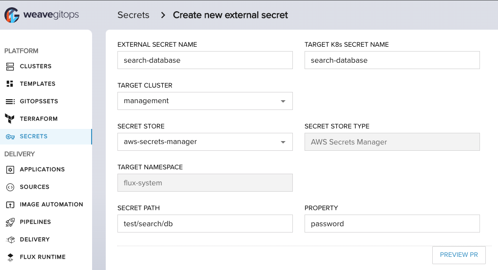

# Getting started with secrets management ~ENTERPRISE~

!!! warning
    **This feature is in alpha and certain aspects will change**
    We're very excited for people to use this feature.
    However, please note that changes in the API, behaviour and security will evolve.
    The feature is suitable to use in controlled testing environments.

This guide shows you a basic experience to get started with Weave Gitops Secrets.
It covers the scenario of setting up the capability in a test environment and how to use it for your applications.

## Requirements
- You have a test Weave Gitops Enterprise environment with Flux installed.
- You have a secret in AWS secrets manager.

## Add the secrets infra

In order to be able to manage external secrets stores and secrets, add `external-secrets` application from `weaveworks-charts` profiles repository.


Include via `values.yaml` the configuration to deploy the [SecretStore](https://external-secrets.io/v0.8.1/api/secretstore/)
connecting to AWS Secrets Manager.

```yaml
  values:
    secretStores:
      enabled: true
      path: ./clusters/bases/secrets
      sourceRef:
        kind: GitRepository
        name: flux-system
        namespace: flux-system
```
This example points to the path `clusters/bases/secrets` in our configuration repo where a kustomization exists

```yaml
apiVersion: kustomize.config.k8s.io/v1beta1
kind: Kustomization
resources:
- aws-secrets-manager.yaml
```

With the AWS Secrets Manager secret store

```yaml
apiVersion: external-secrets.io/v1beta1
kind: SecretStore
metadata:
  name: aws-secrets-manager
  namespace: flux-system
spec:
  provider:
    aws:
      auth:
        secretRef:
          accessKeyIDSecretRef:
            key: access-key
            name: awssm-secret
          secretAccessKeySecretRef:
            key: secret-access-key
            name: awssm-secret
      region: eu-north-1
      service: SecretsManager
```

Review and merge the PR and see it available in your cluster


## Create the secret

Given you have a secret in AWS Secrets Manager for example `test/search/db`.


Create the External Secret manifest via [Secrets UI](./manage-secrets-ui.md) to pull the secret from your store into your environment.



See it available in your cluster.


## Use the secret

At this stage you have everything you need for your application to [consume the secret](https://kubernetes.io/docs/concepts/configuration/secret/#using-a-secret).
Add it to your application as usual.

??? example "Expand to see example"

    ```yaml
    apiVersion: v1
    kind: Pod
    metadata:
    name: secret-dotfiles-pod
    spec:
    volumes:
    - name: database-secrets
        secret:
        secretName: search-database
    containers:
    - name: dotfile-test-container
        image: registry.k8s.io/busybox
        command:
        - ls
        - "-l"
        - "/etc/database-secrets"
        volumeMounts:
        - name: database-secrets
        readOnly: true
        mountPath: "/etc/database-secrets"
    ```

You could see the expected secret available

```bash
kubectl logs -f secret-dotfiles-pod

total 0
lrwxrwxrwx    1 root     root            15 Apr  5 17:26 password -> ..data/password
```

## Next steps?

- For other setup scenarios using external secrets, see [setup ESO](./setup-eso.md)
- For SOPS secrets, see [setup SOPS](./setup-sops.md)
- To discover the UI capabilities to manage secrets, see [here](./manage-secrets-ui.md)
