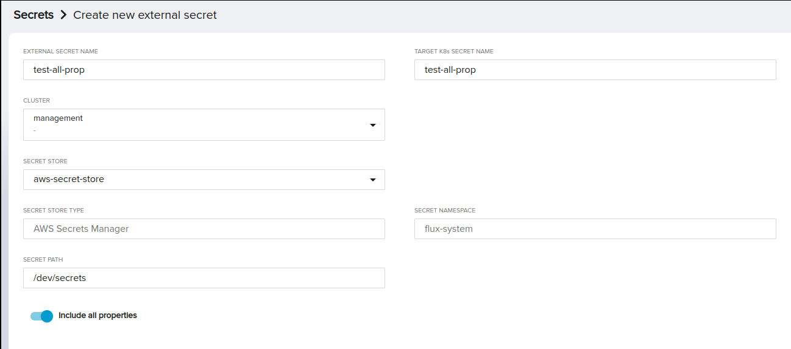
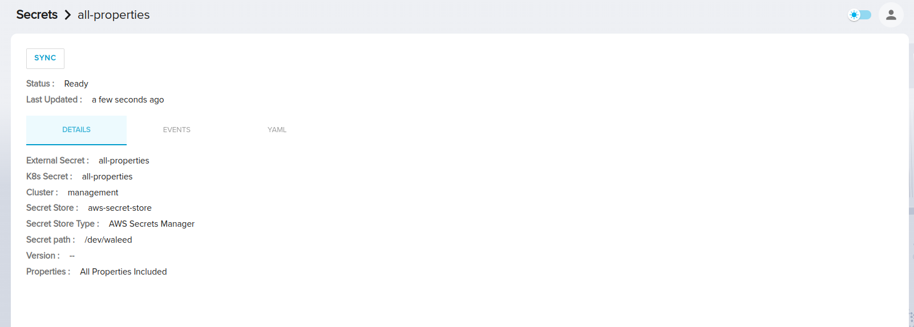
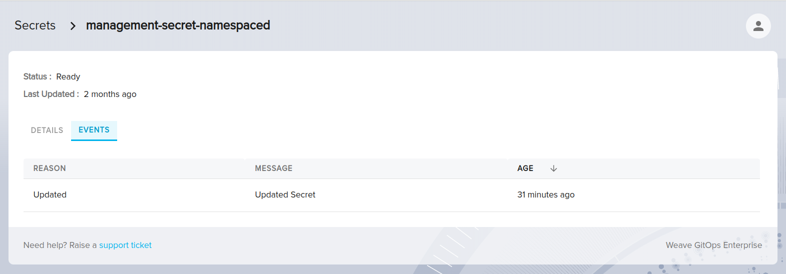
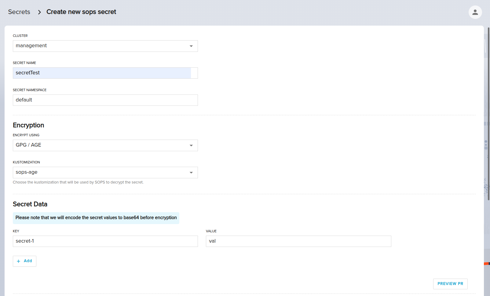

# Manage Secrets UI ~ENTERPRISE~

At Weave GitOps Enterprise (WGE), we support two approaches for creating and managing secrets: [External Secrets Operator](https://external-secrets.io/v0.8.1/) and [Mozilla SOPS](https://fluxcd.io/flux/guides/mozilla-sops/). In this guide, we will provide an overview of both approaches and explain how to use the UI to create and manage secrets.

Clicking on the Secrets under the Platform section in the left hand menu will bring you to the secrets page where you can create external secrets, sops secrets, and view the external secrets list.

## External Secrets

### Prerequisites

Setup the External Secrets Operator by following [this](./setup-eso.md) guide.

### Create External Secret CR

To create a new `ExternalSecret` CR, start by clicking on to the `Create External Secret` button to navigate to the creation page.


Here, you will be prompted to enter the `External Secret Name` and the `Target K8s Secret Name`. Once you choose the `Target Cluster`, you will find a new list of all the `Secret Stores` on this cluster to choose from.

It's important to note that the chosen `SecretStore` may be a cluster-scoped `SecretStore` ie: `ClusterSecretStore` or a namespace-scoped `SecretStore`.

If you choose a namespace scoped `SecretStore`, the new secret will be created on the same namespace as the `SecretStore`.


If you choose a cluster-scoped `ClusterSecretStore`, the new secret will be created in a namespace of your choice.


Then you need to add the `SecretPath`, which is the path to the external secret within the secret store.

#### Adding Secret Properties

After you have chosen your desired `SecretStore` & `SecretPath` the UI allows you to add secret properties in two differen scenarios:

##### 1. Adding specific properties

The first scenario allows you to add specific property fields. Each added `property` also has an optional `SecretKey` field. Here's how to do it:

In the `Properties` section, click the `Add` button to create a new property field.


Enter the name of the `property` you want to create. You can add as many properties as you need.


If you wish to specify a `SecretKey` for the property, enter it in the `SecretKey` field. If this field is left blank, the `property` name will be used as the `SecretKey`.


To remove a property, click the `Remove` sign next to the property you wish to delete.

Remember, this option allows you to have fine-grained control over which properties are included in your `ExternalSecret`.

##### 2. Including All Properties

The second scenario is to include all properties in your `ExternalSecret`. If the `Include all properties` checkbox is checked, all property inputs will be disabled and ignored, and all secrets including all keys under the specified `SecretPath` will be added. Here's how:

Check the `Include all properties` checkbox. This will automatically disable the property input fields.



Using this option allows you to quickly create an `ExternalSecret` that includes all secrets under a specific `SecretPath`, without the need to specify each one individually.

!!! warning
    Remember to use this option with caution. You may not need to expose all your secret properties to be on the cluster.

This process allows you to easily create new `ExternalSecret` CRs without needing to manually create them through YAML files or command line tools.

### List External Secrets


The ExternalSecrets List section of the UI allows you to view all the external secrets that are currently stored in your Kubernetes clusters. This section provides an overview of each external secret, including its name, namespace, cluster, k8s-secret, secret-store and the age. From this page, you can also navigate to the details page to view more information about a specific secret.

### External Secret Details

The details page displays the details of a specific external secret, including its name, namespace, data, and creation date. Below are the details that you can expect to see on this page:

- **Status:** This indicates the current status of the external secret, which can be "Ready" or "Not Ready" depending on whether the external secret has been successfully created and is ready for use.
- **Last Updated:** This shows the date and time when the external secret was last updated.
- **External Secret:** This is the name of the external secret that you are viewing.
- **K8s Secret:** This is the name of the Kubernetes secret that is associated with the external secret.
- **Cluster:** This indicates which cluster the external secret exists on.
- **Secret Store:** This shows the name of the secret store provider that is being used to store the external secret.
- **Secret Store Type:** This indicates the type of secret store that is being used to store the external secret. In this case, the type is "AWS Secrets Manager".
- **Secret path:** This is the path to the external secret within the secret store.
- **Version:** This shows the version of the external secret, which may be blank if no version has been specified.

- #### Properties

  Based on the configuration of the external secret, this section will vary:

- If the "Include all properties" option was selected during the creation of the external secret, this section will display the text "All properties are included".


- If specific properties were manually added during creation, this section will display a table with two columns: "Property" and "SecretKey". This table lists all the property and secret key pairs added to the external secret.


Understanding the information provided on the details page can help you to manage and troubleshoot your external secrets as needed.

### Understanding Events



The following events can be expected when using the UI to manage external secrets:

- **Updated:** This event indicates that an existing external secret has been successfully updated with new data.
- **Not Ready:** This event indicates that there was an issue with the secret store when trying to access or synchronize external secrets. This includes situations such as the secret store being unavailable or not ready to handle requests, or issues with authentication when trying to access the secret store.

Understanding these events can help you to troubleshoot issues that may arise when managing external secrets using the UI. In particular, if you encounter a `Not Ready` event, you may need to check your secret store credentials and ensure that the secret store is operational before proceeding with any further actions.

## SOPS

### Getting Started with SOPS

Creating a [SOPS](https://github.com/mozilla/sops#usage) secret involves using the SOPS tool to encrypt a file containing sensitive information, such as credentials or API keys. This encrypted file can then be stored securely in version control or another location, with only authorized users able to decrypt it using their own private key. This adds an additional layer of security to sensitive data, reducing the risk of unauthorized access or accidental exposure.

### Prerequisites

For more information about how to generate OpenPGP/age keys and configure your cluster to work with Weave GitOps Enterprise secrets management follow [this](./setup-sops.md) guide.

### Create SOPS Secret

To create a new SOPS secret, start by clicking on the `Create Sops Secret` button.


This will open the create form where you can specify the details of your new secret. First, choose the `Cluster` where you want to create the secret. Then, enter a `name` for your secret and select the `namespace` where it will be created.



Next, select the `encryption method` that you want to use - currently, only GPG/AGE encryption is supported. Finally, choose the `kustomization` that will be used by SOPS to decrypt the secret, as well as, having the public key info that will be used to encrypt the secret data. Afterwards, add your `key-value` pairs of your secrets.
It's important to note that the `value` input will be encoded to base64.

The generated secret should be something like below.


After approving the pull request, Flux will reconcile it to your cluster. To verify that the secret has been successfully created, you can use the following command to retrieve it as YAML:

```bash
kubectl get secret secretTest-default-sops-secret -n default -o yaml
```

which will give the following output:

```yaml
apiVersion: v1
data:
  secret-1: dmFsCg==
kind: Secret
metadata:
  name: secretTest-default-sops-secret
  namespace: default
type: Opaque
```
