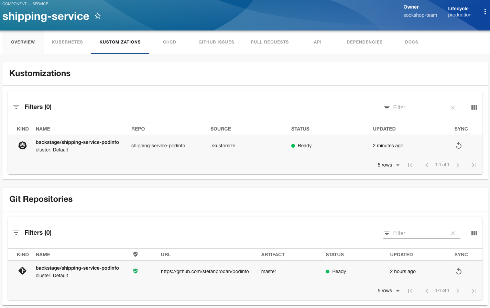

Are you running [Backstage](https://backstage.io) and [Flux](https://fluxcd.io)? Do you want to expose the state of your Flux resources in your Backstage portal?

The `@weaveworksoss/backstage-plugin-flux` Backstage plugin provides a set of components that you can add to your existing Backstage app to display the state of Flux resources.

## Installation

We provide the full installation instructions in the plugin [repository](https://github.com/weaveworks/weaveworks-backstage/tree/main/plugins/backstage-plugin-flux). But first you will need to install the [Kubernetes plugin](https://backstage.io/docs/features/kubernetes/) and configure it to access the clusters you want to query Flux resources from.

You will need to install the plugin to your frontend app:

```console
# From your Backstage root directory
yarn add --cwd packages/app @weaveworksoss/backstage-plugin-flux
```

Then add the components you want to your [EntityPage](https://backstage.io/docs/plugins/integrating-plugin-into-software-catalog/#import-your-plugin-and-embed-in-the-entities-page).

Currently, the Backstage plugin provides the following components:

- EntityFluxDeploymentsCard - shows a combined view of HelmReleases and Kustomizations
- EntityFluxSourcesCard - shows a combined view of GitRepositories, OCIRepositories and HelmRepositories
- EntityFluxHelmReleasesCard
- EntityFluxKustomizationsCard
- EntityFluxGitRepositoriesCard
- EntityFluxOCIRepositoriesCard
- EntityFluxHelmRepositoriesCard

For example, to add the `EntityFluxHelmReleasesCard` to your Entity home page for components with the `backstage.io/kubernetes-id` entity annotation.

```tsx title="packages/app/src/components/catalog/EntityPage.tsx"
import {
  EntityFluxHelmReleasesCard,
} from '@weaveworksoss/backstage-plugin-flux';
import { isKubernetesAvailable } from '@backstage/plugin-kubernetes';

const overviewContent = (
  <Grid item md={6}>
   <EntityAboutCard variant="gridItem" />
  </Grid>

  <EntitySwitch>
    <EntitySwitch.Case if={isKubernetesAvailable}>
      <EntityFluxHelmReleasesCard />
    </EntitySwitch.Case>
  </EntitySwitch>
);
```

When you view components with the correct annotation:

```yaml
apiVersion: backstage.io/v1alpha1
kind: Component
metadata:
  name: catalogue-service
  description: A microservices-demo service that provides catalogue/product information
  annotations:
    backstage.io/kubernetes-id: podinfo
```

This will query across your configured clusters for `HelmReleases` that have the correct label:

```yaml
apiVersion: helm.toolkit.fluxcd.io/v2beta1
kind: HelmRelease
metadata:
  name: podinfo
  namespace: podinfo
  # The label here is matched to the Backstage Entity annotation
  labels:
    backstage.io/kubernetes-id: podinfo
spec:
  interval: 5m
  chart:
    spec:
      chart: podinfo
      version: '6.3.6'
      sourceRef:
        kind: HelmRepository
        name: podinfo
        namespace: podinfo
```


## Building a Custom Page with Resources

Instead of displaying the state on the overview page, it's possible to compose a page displaying the state of resources.

For example, to add a page `/kustomizations` to your Entity for components with the `backstage.io/kubernetes-id` entity annotation:

```tsx title="packages/app/src/components/catalog/EntityPage.tsx"
import {
 EntityFluxGitRepositoriesCard,
 EntityFluxKustomizationsCard,
} from '@weaveworksoss/backstage-plugin-flux';
import { isKubernetesAvailable } from '@backstage/plugin-kubernetes';

const serviceEntityPage = (
  // insert in the page where you need it

  <EntityLayout.Route path="/kustomizations" title="Kustomizations" if={isKubernetesAvailable}>
    <Grid container spacing={3} alignItems="stretch">
      <Grid item md={12}>
        <EntityFluxKustomizationsCard />
      </Grid>
      <Grid item md={12}>
        <EntityFluxGitRepositoriesCard />
      </Grid>
    </Grid>
  </EntityLayout.Route>
);
```



## Connecting to WeaveGitOps

You can connect the plugin to your Weave GitOps installation through your config:

```yaml title="app-config.yaml"
app:
  title: Backstage Example App
  baseUrl: http://localhost:3000
...
gitops:
  # Set this to be the root of your Weave GitOps application
  baseUrl: https://example.com
```

**NOTE**: The plugin will generate URLs relative to this URL and link to them from the displayed resources.
