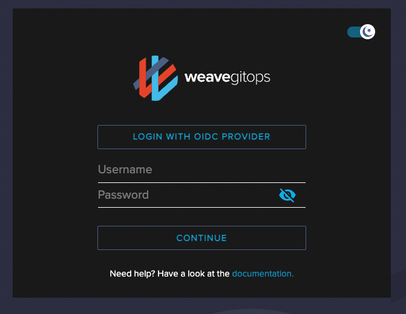
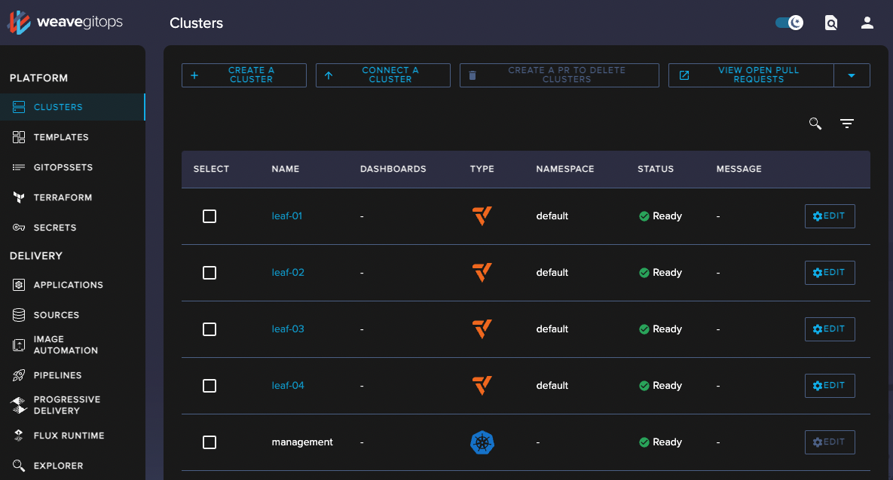

import Tabs from "@theme/Tabs";
import TabItem from "@theme/TabItem";
import TierLabel from "@site/docs/_components/TierLabel";
import AlphaWarning from "../../_components/_alpha_warning.mdx";
import CurlCodeBlock from "../../_components/CurlCodeBlock";
import oauthBitbucket from '/img/oauth-bitbucket.png';
import oauthAzureDevOps from '/img/oauth-azure-devops.png';
import oauthAzureDevOpsSuccess from '/img/oauth-azure-devops-success.png';


# Step 1 - Getting Started <TierLabel tiers="Enterprise" />

:::info What to expect
You are a Platform Engineer in charge of discovering or setting up Weave GitOps Enterprise for your organisation.

Use this guide to get you up and running quickly. We assume limited knowledge on the product so will take some default decisions for you.
:::

## Before you start

:::tip
See Weave GitOps Enterprise [Concepts](/docs/references/concepts/) for any domain-specific term.
:::


- [ ] You have a **Git Repository** to bootstrap with **write** permissions to push resources.
- [ ] You have a **Management Cluster** to bootstrap (accessible via Kubeconfig) with **cluster-admin** to create resources.
- [ ] You have installed [Flux CLI](https://fluxcd.io/flux/installation/#install-the-flux-cli) and [Weave GitOps Enterprise CLI](#install-weave-gitops-enterprise-cli)
- [ ] You have **Weave GitOps Enterprise Entitlements** provided by [Sales](/help-and-support/).

:::warning Write Modes & Permissions
Bootstrapping requires you to have both **cluster admin** permissions on the Management Cluster and **push** permissions
to the Git repository to write the generated resources.
:::

### Install GitOps CLI
   <Tabs groupId="weave-gitops-cli" default="homebrew">
   <TabItem value="homebrew" label="Homebrew">

   ```bash
    brew install weaveworks/tap/gitops-ee
   ```

   </TabItem>
   <TabItem value="curl" label="curl">

   ```bash
    export VERSION=$VERSION
    curl --silent --location "https://artifacts.wge.dev.weave.works/releases/bin/${VERSION}/gitops-$(uname)-$(uname -m).tar.gz" | tar xz -C /tmp
    sudo mv /tmp/gitops /usr/local/bin
    gitops version
   ```

   </TabItem>
   </Tabs>

### Install Entitlements

Weave GitOps Enterprise Entitlement is your obtained license to use our product. The Entitlements file is a Kubernetes secret that contains your licence.
To get the entitlement secret please contact *sales@weave.works*, then apply it on your management cluster with the name `weave-gitops-enterprise-credentials` under `flux-system` namespace.

```bash
 kubectl apply -n flux-system -f entitlements.yaml
```
## Bootstrapping

Bootstrapping is the workflow that installs Weave GitOps Enterprise in your environment by executing these stages:

1. **Bootstrap Flux**: bootstrap Flux on your Management Cluster.
2. **Entitlements**: verify your Entitlements.
3. **Authentication**: configure how users authenticate.
4. **Authorization**: configure what your users and other subjects can do.
5. **Install WGE**: deploy Weave GitOps Enterprise via Flux Helm Release.
6. **Access the dashboard**: access the application as you expect.
7. **Extend WGE**: add other capabilities to support your Platform workflows.

Run the method that better match your expectations.

<Tabs groupId="flux bootstrap" defaultValue="cli-interactive">
<TabItem value="cli-interactive" label="CLI Interactive">

:::tip Recommended path if:

You have limited knowledge about the product and / or want guidance step-by-step.
:::

 ```bash
 # Run the command to follow the interactive session.
 gitops bootstrap
 ```
- For more information about the CLI configurations, check the below sections [here](#cli-configurations)
- For more information about what is happening under the hoods, see [Manual Bootstrapping](../install-enterprise-getting-started-manual)
    
<AlphaWarning/>
</TabItem>
<TabItem value="cli-not-interactive" label="CLI Non Interactive">

:::tip Recommended Path if:
You are already familiar with installing Weave GitOps Enterprise. You wan to leverage the CLI for consistency and automation.
:::

You could run the bootstrap command in non-interactive mode by providing the required configurations as flags. Use `gitops bootstrap --help` for examples to guide you:

```bash
# Bootstrap Weave GitOps Enterprise and Flux over SSH
gitops bootstrap --silent --bootstrap-flux \
    --version="0.38.0" --password="admin-password" \
    --repo-url="ssh://repo-url" --branch="git-branch>" --repo-path="path-management-cluster"  \
    --private-key-path="private-key-path" --private-key-password="private-key-password"

# Add Weave GitOps Enterprise to an existing SSH Flux installation
gitops bootstrap --silent \
    --version="0.38.0" --password="admin-password" \
    --repo-url="ssh://repo-url" --branch="git-branch" --repo-path="path-management-cluster"  \
    --private-key-path="private-key-path" --private-key-password="private-key-password"
```

- For more information about the CLI configurations, check the below sections [here](#cli-configurations)
- For more information about what is happening under the hoods, see [Manual Bootstrapping](../install-enterprise-getting-started-manual)

<AlphaWarning/>

</TabItem>
<TabItem value="manual" label="Manual">

:::tip Recommended Path if:
You want to have full control on the process or your context cannot be handled via the CLI.
:::

Continue to [Manual Bootstrapping](../install-enterprise-getting-started-manual) to guide you.

</TabItem>
</Tabs>

## Access the dashboard

Weave GitOps Enterprise dashboard is available by default via ClusterIP service. You could use the `port-forward` command
output as part of the bootstrapping session or the one below:

```bash
 kubectl -n flux-system port-forward svc/clusters-service 8000:8000
```
Access your browser on [http://localhost:8000](http://localhost:8000) to see the login page.



`Login` with your username and password credentials to land in the main page.



## Next Steps

You have bootstrapped Weave GitOps Enterprise and Flux on your Management Cluster. Continue to
[Step 2 - Onboarding](../install-enterprise-getting-started-onboard) to harden your environment
to onboard the rest of the team.
