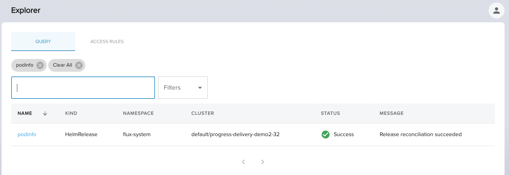

import TierLabel from "./../_components/TierLabel";
import AlphaWarning from "../_components/_alpha_warning.mdx";

# Querying <TierLabel tiers="Enterprise" />

<AlphaWarning/>

Explorer recommended way to discover resources is via its search dialog. This guide provides the background to understand
it and set how to use it.

## Schema

Every resource is normalised to the following common schema:

| __Key__                  | __Description__                                                     |
| -----------------          | --------------                                                  |
| Cluster                    | Name of cluster where the resource exists. As gitops cluster `<GitopsClusterNamespace,GitopsClusterName>`|
| Namespace                  | Namespace name where the resource exists.|
| Kind                  | Resource kubernetes type or [kind](https://kubernetes.io/docs/reference/using-api/api-concepts/#standard-api-terminology)|
| Name                  | Resource name as specified in its manifest.|
| Status                  | Resource health status. Indicates the status of its reconciliation.|
| Message                  | Resource health status message. It extends status field with information about the status.|

For a `podinfo` helm release from a cluster `default/progress-delivery-demo2-32` like this:

```yaml
apiVersion: helm.toolkit.fluxcd.io/v2beta1
kind: HelmRelease
metadata:
  name: podinfo
  namespace: flux-system
spec:
  chart:
    spec:
      chart: podinfo
      interval: 1m
      reconcileStrategy: ChartVersion
      sourceRef:
        kind: HelmRepository
        name: podinfo
      version: 6.0.0
  interval: 1m
status:
  conditions:
  - message: Release reconciliation succeeded
    reason: ReconciliationSucceeded
    status: "True"
    type: Ready
```

The schema looks like

| Cluster    | Namespace | Kind          | Name    | Status    | Message                 |
|------------| ---------| ----------------|---------|----------|------------------------|
|`default/progress-delivery-demo2-32` | `flux-system`   | `HelmRelease` | `podinfo` | `Success` | `Release reconciliation succeeded`  |

And represented in the UI like


## Querying

Based on the previous schema you have two main modes to discover or filter the data

1. Filter by key and value: when you know the pair <key,value> that you want to filter from.
2. Filter by value: when you want to filter across keys or does not know the key

:::info Matching

For `key:value` filter the results would be those results where `key=value` exactly.
:::


### Filter by key and value

You search with the format `key:value` indicating that you want to filter the resources matching the key and value.
A couple of examples could be:

- `kind:HelmRelease` to filter all helm releases.
- `status:Failed` to find all failing resources.

### Filter by value
You search with a single term `value` indicating that you want to filter across the supported keys by values.
The value would be search cross keys: `name`, `namespace` and `cluster` as synthatic sugar for `name:value` OR `namespace:value` OR `cluster:value`.

An example cold be using `podinfo` that would translate into `name:podinfo` OR `namespace:podinfo` OR `cluster:podinfo`.

### Operators

#### AND

You could refine filtered results by using AND semantics adding different filters.

For example if you want to have all the resources within `flux-system` namespace from `management` cluster you could
create a query like the following:


with two sequential filters

`namespace:flux-system` and `cluster:management` you can

## FAQ

Here a set of questions around querying to allow you get started by practice.

### How can I discover resources from a cluster?

### How can I discover resources from a namespace?

### How can I discover applications?

### How can I discover failed applications?

### How can I discover resources by name?


## Querying

Just typing `podinfo` in the search dialog returns the applications that matches the term



For more info on how querying works to query and advanced queries see [querying](./querying.mdx).


// Full guidance on querying

## Next Steps
// Add next steps


