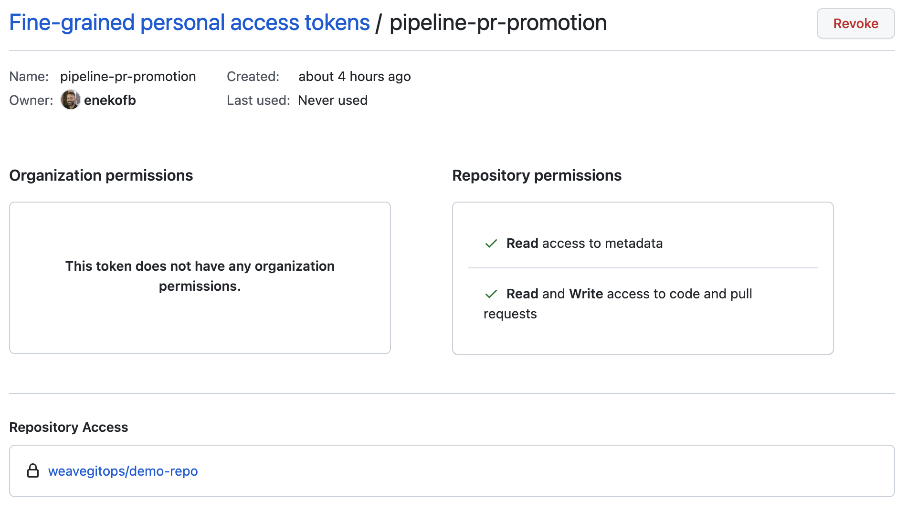

import TierLabel from "./../_components/TierLabel";
import Tabs from "@theme/Tabs";
import TabItem from "@theme/TabItem";

import AlphaWarning from "../_components/_alpha_warning.mdx";
import ManualPromotionUI from "./img/manual-promotion-ui.png";


# Promoting applications through pipeline environments <TierLabel tiers="Enterprise" />


<AlphaWarning/>

Pipelines allow you to configure automatic promotions of applications through a consecutive set of environments, e.g. from dev to staging to production. The environments are defined in the `Pipeline` resource itself so that each pipeline governs a single application and all the environments to which it is deployed.

:::info
At the moment only applications defined as Flux `HelmReleases` are supported in automatic promotions.
:::

<figure>


<figcaption>An example of a pull request for an application promotion</figcaption>
</figure>

The [Getting Started Guide](../pipelines-getting-started) describes how to create a basic pipeline for an application so you can visualize its deployments across a series of environments. You may also configure a pipeline in order to promote applications across a series of environments.
There are currently two supported strategies for application promotions:
- Pull request strategy: this strategy is used for applications that are delivered via Flux to all environments of a pipeline. Typically, the versions of these applications are stored in Git and therefore pull requests can be used to update them as part of a promotion.
- Notification strategy: this strategy is used when an external CI system is responsible for promoting an application across the environments of a pipeline. In this strategy, the notification controller running on the management cluster is used to forward notifications of succesful promotions to external CI systems.

Before configuring any of the above promotion strategies, you need to setup notifications from all your environments so that whenever a new version gets deployed, the promotion webhook component of the pipeline controller is notified and takes an action based on the pipeline definition. The rest of this guide describes the configuration needed to setup application promotion via pipelines.

## Expose the promotion webhook

Applications deployed in leaf clusters use the Flux notification controller running on each leaf cluster, to notify the management cluster of a successful promotion. This requires network connectivity to be established between the leaf cluster and the management cluster.

The component responsible for listening to incoming notifications from leaf clusters is the pipeline controller. It hosts a webhook service that needs to be exposed via an ingress resource to make it available for external calls. Exposing the webhook service is done via the Weave GitOps Enterprise Helm chart values and the configuration used depends on your environment. The example below shows the configuration for NGINX ingress controller and needs to be adjusted if another ingress controller is used:

```yaml
spec:
  values:
    enablePipelines: true
    pipeline-controller:
      promotion:
        ingress:
          enabled: true
          className: nginx
          annotations:
            cert-manager.io/cluster-issuer: letsencrypt
          hosts:
          - host: promotions.example.org
            paths:
            - path: /?(.*)
              pathType: ImplementationSpecific
          tls:
          - secretName: promotions-tls
            hosts:
            - promotions.example.org
```

You will need the externally reachable URL of this service later on in this guide.

## Setup notifications from leaf clusters

Once the webhook service is exposed over HTTP/S, you need to create alert/provider resources to send notifications to it from leaf clusters. These notifications represent successful promotions for applications running on the leaf clusters.

Successful promotion events are triggered by Flux's [notification controller](https://fluxcd.io/flux/components/notification/). You create a Provider pointing to the promotion webhook exposed earlier and an Alert targeting the app's HelmRelease:

```yaml
---
apiVersion: notification.toolkit.fluxcd.io/v1beta1
kind: Provider
metadata:
  name: promotion-my-app
spec:
  address: "https://promotions.example.org/promotion/pipeline-01/my-app/dev"
  type: generic-hmac
  secretRef:
    name: hmac-secret
```

In the example above, the `generic-hmac` Provider is used to ensure notifications originate from authenticated sources. The referenced Secret, should include a `token` field which holds the HMAC key. The same HMAC key must be specified in the Secret referenced by the `.spec.promotion.strategy.secretRef.name` field, so that the pipeline controller can verify any incoming notifications. For more information on the `generic-hmac` Provider, please refer to the notification controller [docs](https://fluxcd.io/flux/components/notification/provider/#generic-webhook-with-hmac).

Note that by default, the promotion webhook endpoint is exposed at `/promotion` as shown in the example above. However you may use rewrite rules in your ingress configuration to omit it, if desired. For example, if using NGINX ingress controller, you may use the following annotation:
```yaml
annotations:
  nginx.ingress.kubernetes.io/rewrite-target: /promotion/$1
```
The Provider address can then be set as `https://promotions.example.org/pipeline-01/my-app/dev`.

:::tip
You may also use the [generic webhook provider type that supports HMAC verification](https://fluxcd.io/flux/components/notification/provider/#generic-webhook-with-hmac) to ensure incoming notifications originate from authenticated sources. 
:::

The `address` field's URL path is comprised of 3 components again:

1. The namespace of the app's pipeline.
1. The name of the pipeline resource.
1. The origin environment's name. This is the name of the environment that the event is created in, e.g. "dev" for events coming from the "dev" environment.

Weave GitOps Enterprise can then parse the incoming URL path to identify the pipeline resource and look up the next environment for the defined promotion action.

An example Alert might look like this:

```yaml
---
apiVersion: notification.toolkit.fluxcd.io/v1beta1
kind: Alert
spec:
  eventSeverity: info
  eventSources:
  - kind: HelmRelease
    name: my-app
  exclusionList:
  - .*upgrade.*has.*started
  - .*is.*not.*ready
  - ^Dependencies.*
  providerRef:
    name: promotion-my-app
```

:::tip
Be sure to create the Provider/Alert tuple on **each of the leaf clusters
targeted by a pipeline**.
:::

Now as soon as the `HelmRelease` on the first environment defined in the pipeline is bumped (e.g. by Flux discovering a new version in the Helm repository), an event is sent to the promotion webhook which will determine the next action based on the pipeline definition and chosen strategy. The rest of this guide describes how to setup up any of the available strategies depending on your requirements. 

## Pull request

This section covers adding a promotion by pull request (PR) strategy, so that whenever the application defined in a pipeline
is upgraded in one of the pipeline's environments, a PR is created that updates the manifest file setting the application version in the next environment.

The dynamic nature of GitOps deployments requires you to assist Weave GitOps a little with information on which repository hosts the manifest files,
how to authenticate with the repository and the Git provider API, and which file hosts the version definition for each environment.

:::caution

Creating pull requests requires read and write access in your git repo.
A compromised token could lead to changing the git repository and creation of legitimate looking changes/pull requests.

Ensure you understand and adopt [security recommendations](./#security-recommendations) before using the feature.

:::

### Supported Git Providers
The following Git providers are currently support by this promotion strategy:

- [GitHub](https://github.com/)
- [GitLab](https://gitlab.com/)
- [BitBucket Server / DataCenter](https://www.atlassian.com/software/bitbucket/enterprise)

Select your Git provider via `.spec.promotion.strategy.pull-request.type`. For example, for `gitlab` it would look similar to:

```yaml
promotion:
  strategy:
    pull-request:
      type: gitlab
      url: "https://gitlab.com/weaveworks/<my-awesome-project.git>"
      baseBranch: main
      secretRef:
        name: gitlab-promotion-credentials
```

More info in the [spec](../spec/v1alpha1/pipeline/#pipeline).

### Credentials Secret

In the journey of creating a pull request, there are different secrets involved:

1. Pipeline controller receives events via [webhook from leaf clusters](./#setup-notifications-from-leaf-clusters). Hmac is used for authN/authZ so an hmac key should be provided in this case.
2. Pipeline controller clones and patches manifests to promote from the pipeline configuration repo. A set of [git credentials](https://fluxcd.io/flux/components/source/gitrepositories/#secret-reference) are required.
3. Pipeline controller uses git provider api to create the pull request with the promoted manifests. A Personal Access Token (PAT) needs to be created to interact with pipelines git provider API. This PAT is also used to list pull requests from the configured repository.

Create a Kubernetes secret with the previous data.

<details><summary>Expand to see example</summary>

```shell
# example to use git over https with basic auth and pat
$ kubectl create secret generic promotion-credentials \
  --namespace=pipeline-01 \
  --from-literal="username=<bot account name>" \
  --from-literal="password=<token value>" \
  --from-literal="token=<token value>" \
  --from-literal="hmac-key=<hmac-key value>"
```

```yaml
---
apiVersion: v1
kind: Secret
metadata:
  name: promotion-credentials
  namespace: pipeline-01
data:
  username: ZXhhbXBsZQ==
  password: ZXhhbXBsZS1wYXNzd29yZA==
  token: Z2hwX01IL3RsTFpXTXZMY0FxVWRYY1ZGL0lGbzh0WDdHNjdsZmRxWQ==
  hmac-key: OEIzMTNBNjQ0REU0OEVGODgxMTJCQ0VFNTQ3NkE=
type: Opaque
```

:::tip
- The Git provider token provided in the `token` field needs to be given permission to create pull requests in the pipeline's repository (defined in `.spec.promotion.strategy.pull-request.url`).
- The `hmac-key` field must match the key used for the Provider resource (.spec.secretRef), if specified in the leaf clusters.
:::

</details>

### Define promotion in pipeline resource

The field `.spec.promotion.strategy.pull-request` defines details about the Git repository used for promoting the given app.
Set the `secretRef.name` field to the name of the Secret created in the previous step and the `url` and `branch` fields to the
Git repository's HTTPS URL and optionally a specific branch (if the branch is not set, it defaults to `main`).
If using the `generic-hmac` Provider from leaf clusters, also set the `.spec.promotion.strategy.secretRef.name` to the name of the Secret created previously.

More info in the [spec](../spec/v1alpha1/pipeline/#pipeline)

### Security Recommendations

:::tip

Adopt as much of the recommendations in this section to reduce the risks associated with the secrets involved in pull requests.

:::

1. **Create a user account for pull request changes**: this user context would be used to do any git provider operation,
and for security and auditing perspective, you don't want to impersonate a real user for it.

<details><summary>Expand to see example</summary>


</details>

2. **Restrict access to the secret**: the promotion credentials needs to reside in the same Namespace as the Pipeline resource on the management cluster. Restrict
via RBAC that only `pipeline-controller` service account is able to read it.

<details><summary>Expand to see example</summary>

```yaml
---
apiVersion: rbac.authorization.k8s.io/v1
kind: Role
metadata:
  name: read-app-promotion-credentials
  namespace: app
rules:
  - apiGroups:
      - ""
    resourceNames:
      - "app-promotion-credentials"
    resources:
      - "secrets"
    verbs:
      - "get"
---
apiVersion: rbac.authorization.k8s.io/v1
kind: RoleBinding
metadata:
  name: pipeline-controller-read-app-promotion-credentials
  namespace: app
roleRef:
  apiGroup: rbac.authorization.k8s.io
  kind: Role
  name: read-app-promotion-credentials
subjects:
  - kind: ServiceAccount
    name: pipeline-controller
    namespace: pipeline-system
```
</details>

3. **Do not use long-live tokens**: set an expiration date and rotate them according to your security policy.

<details><summary>Expand to see example</summary>


</details>

4. **Honour the least privilege principle**: avoid having high privilege tokens. Restrict the token to your just your repo and to just the operations required.

<details><summary>Expand to see example</summary>

For example, if the case of GitHub, use [fine-grained tokens](https://github.blog/2022-10-18-introducing-fine-grained-personal-access-tokens-for-github/) to only
allow access to the single repo that your configuration manifests exist.


 </details>

5. **Review active access tokens on a regular basis**: to ensure that only the ones that are required are present at all times.

<details><summary>Expand to see example</summary>

For example, using github and fine-grained tokens you [could do so](https://github.blog/2022-10-18-introducing-fine-grained-personal-access-tokens-for-github/#approving-and-auditing-personal-access-tokens).


</details>

6. **Review git provider recommendations and examples**
- [GitHub](https://docs.github.com/en/authentication/keeping-your-account-and-data-secure/creating-a-personal-access-token)
- [GitLab](https://docs.gitlab.com/ee/user/profile/personal_access_tokens.html)


### Add markers to app manifests

The discovery of the version field is done using deterministic markers in a YAML manifest file. An example `HelmRelease` manifest with such a marker looks like this:

```yaml {7}
---
apiVersion: helm.toolkit.fluxcd.io/v2beta1
kind: HelmRelease
spec:
  chart:
    spec:
      version: 0.13.7 # {"$promotion": "pipeline-01:my-app:prod"}
```

The value of the `$promotion` field in the comment is comprised of 3 components separated by colons:

1. The first field is the Namespace of the pipeline resource that the app is part of. In the example above this is `pipeline-01`.
1. The second field denotes the name of the pipeline resource.
1. The third field is the name of the environment that this specific HelmRelease targets. The environment name in the marker needs to match with the `name` field of one of the environments defined in the pipeline's `.spec.environments` array.

Weave GitOps Enterprise will look for this marker whenever it receives an event from the respective HelmRelease of one of the leaf clusters and patch the file with the version denoted in the event (see the section above for instructions on setting up notification events from leaf clusters). Finally, it will create a Git provider PR to update the version of the application for the next environment in the pipeline.

## Notification

This section explains how to configure pipelines to work with external CI systems that are responsible for application promotions.

This strategy uses the notification controller running on the management cluster, to forward any notifications received by the promotion webhook, from leaf clusters to external CI systems. This requires to [patch](https://fluxcd.io/flux/cheatsheets/bootstrap/#enable-notifications-for-third-party-controllers) the Flux manifests of the management cluster, in order to allow objects of type `Pipeline` to be used as event sources. An example of a patch applied to enable this is shown below: 

```yaml
---
apiVersion: kustomize.config.k8s.io/v1beta1
kind: Kustomization
resources:
- gotk-components.yaml
- gotk-sync.yaml
patches:
- patch: |
    - op: add
      path: /spec/versions/0/schema/openAPIV3Schema/properties/spec/properties/eventSources/items/properties/kind/enum/-
      value: Pipeline
  target:
    kind: CustomResourceDefinition
    name:  alerts.notification.toolkit.fluxcd.io
```

You can now create Provider/Alert resources on the management cluster to forward notifications to external systems. For example, the Provider resource shown below is used to invoke a GitHub Actions workflow on a repository: 
```yaml
---
apiVersion: notification.toolkit.fluxcd.io/v1beta1
kind: Provider
metadata:
  name: promotion-my-app-via-github-actions
spec:
  type: githubdispatch
  address: https://github.com/my-org/my-app-repo
  secretRef:
    name: github-credentials
```

To use this Provider, add an Alert that uses the pipeline resource defined on the management cluster as an event source. An example of such an Alert is shown below:

```yaml
---
apiVersion: notification.toolkit.fluxcd.io/v1beta1
kind: Alert
metadata:
  name: promotion-my-app-via-github-actions
spec:
  eventSeverity: info
  eventSources:
  - kind: Pipeline
    name: my-app
    namespace: my-app-ns
  providerRef:
    name: promotion-my-app-via-github-actions
```

The notification controller running on the management cluster is now configured to forward any promotion notifications received from leaf clusters. To actually use this strategy from a pipeline, set the promotion field as shown below:

```yaml {8-9}
---
apiVersion: pipelines.weave.works/v1alpha1
kind: Pipeline
metadata:
  name: my-app
  namespace: my-app-ns
spec:
  promotion:
    notification: {}
```

Promotion notifications from leaf clusters should now be forwarded via the notification controller running on the management cluster and should include information about the version of the application being promoted.

## Manual promotion

The supported strategies mentioned above, do not require any user interaction when handling promotions. However, there is often a need for a human operator to manually approve a promotion to the next environment. To achieve that, set the `spec.promotion.manual` key to `true`.

<details><summary>Expand to see example</summary>

```yaml {8}
apiVersion: pipelines.weave.works/v1alpha1
kind: Pipeline
metadata:
  name: my-app
  namespace: my-app-ns
spec:
  promotion:
    manual: true
    strategy:
      pull-request:
        type: github
        url: https://github.com/my-org/my-app-repo
        baseBranch: main
        secretRef:
          name: promotion-credentials              
```

</details>

When this key is set and a promotion is detected, Weave GitOps will prompt the user to manually promote the application to the next environment, via the use of a button shown under the next environment.

<figure>


<figcaption>Manual promotion of an application</figcaption>
</figure>

## Configuration

### Retry Logic

By default if a promotion fails, an exponential back-off retry happens and
returns with an error only after three retries.

Through Helm values, the retry logic is configurable.

```yaml
# values.yaml
promotion:
  retry:
    # Initial delay between retries.
    delay: 2
    # Maximum delay between retries.
    maxDelay: 20
    # Number of attempts.
    threshold: 3
```

The promotion happens through an HTTP endpoint call, that endpoint may has
connection timeout limits, that's why the `maxDelay` option is there. If the
calculated delay would exceed this value, it will use that as delay. For example
if the delay values would be `[2, 4, 8, 16, 32, 64]`, but `maxDelay` is set to
15, the list will be `[2, 4, 8, 15, 15, 15]`. With this option, the promotion
will be retried on failure, but the sum of delay values will be only 59 seconds
instead of 126 seconds.

### Rate Limiting

The promotion endpoint can be exposed to the internet (for example github
actions), to mitigate DoS attacks, the endpoint has rate limits. By default it's
20 requests per 30 seconds.

Rate limiting can be configured through Helm values:

```yaml
# values.yaml
promotion:
  rateLimit:
    # Number of requests allowed in set interval.
    value: 20
    interval: 30
```
