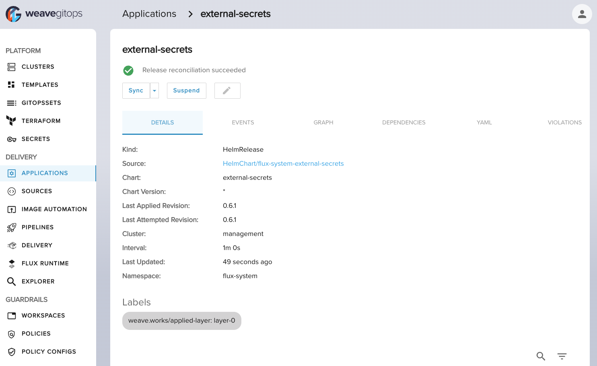

import TierLabel from "./../_components/TierLabel";
import AlphaWarning from "../_components/_alpha_warning.mdx";

# Getting started with secrets management <TierLabel tiers="Enterprise" />

<AlphaWarning/>

This guide shows you a basic experience to get started with Weave Gitops Secrets.
It covers the scenario of setting up the capability in a test environment and how to use it for your applications.

## Requirements
- You have a test Weave Gitops Enterprise environment with Flux installed.
- You have a secret in AWS secrets manager.

## Add the secrets infra

In order to be able to manage external secrets stores and secrets, install `external-secrets` profile
from `weaveworks-charts` profiles repository.

<details><summary>Expand to see example</summary>

```yaml
apiVersion: source.toolkit.fluxcd.io/v1beta2
kind: HelmRepository
metadata:
  name: weaveworks-charts
  namespace: flux-system
spec:
  interval: 1m0s
  provider: generic
  timeout: 1m0s
  url: https://weaveworks.github.io/weave-gitops-profile-examples/
---
apiVersion: helm.toolkit.fluxcd.io/v2beta1
kind: HelmRelease
metadata:
  labels:
    weave.works/applied-layer: layer-0
  name: external-secrets
  namespace: flux-system
spec:
  interval: 1m0s
  chart:
    spec:
      chart: external-secrets
      sourceRef:
        apiVersion: source.toolkit.fluxcd.io/v1beta2
        kind: HelmRepository
        name: weaveworks-charts
        namespace: flux-system
  install:
    crds: CreateReplace
    createNamespace: true
```
</details>

And see it available in your cluster



## Connect your secrets store

In order to connect to your secrets stores, install `secrets-store-config` profile
from `weaveworks-charts` profiles repository with the values for your store.

<details><summary>Expand to see example</summary>

```yaml
apiVersion: helm.toolkit.fluxcd.io/v2beta1
kind: HelmRelease
metadata:
  labels:
    weave.works/applied-layer: layer-0
  name: secrets-store-config
  namespace: flux-system
spec:
  interval: 1m0s
  chart:
    spec:
      chart: secrets-store-config
      sourceRef:
        apiVersion: source.toolkit.fluxcd.io/v1beta2
        kind: HelmRepository
        name: weaveworks-charts
        namespace: flux-system
  values:
    secretStores:
     aws-secrets-manager:
         provider:
           aws:
             service: SecretsManager
             region: eu-north-1
             auth:
               secretRef:
                 accessKeyIDSecretRef:
                   name: awssm-secret
                   key: access-key
                 secretAccessKeySecretRef:
                   name: awssm-secret
                   key: secret-access-key
```
</details>

And see it available in your cluster


## Create the secret

Given you have a secret in AWS Secrets Manager for example `test/search/db`.


Create the External Secret manifest to pull the secret from your store into your environment.

<details><summary>Expand to see example</summary>

```yaml
apiVersion: external-secrets.io/v1beta1
kind: ExternalSecret
metadata:
  name: search-database
  namespace: flux-system
spec:
  dataFrom:
  - extract:
      key: test/search/db
  secretStoreRef:
    kind: SecretStore
    name: aws-secrets-manager
  target:
    name: search-database
```
</details>

See it available in your cluster.


## Use the secret

At this stage you have everything you need for your application to [consume the secret](https://kubernetes.io/docs/concepts/configuration/secret/#using-a-secret)
Add it to your application as usual.

<details><summary>Expand to see example</summary>

```yaml
apiVersion: v1
kind: Pod
metadata:
  name: secret-dotfiles-pod
spec:
  volumes:
  - name: database-secrets
    secret:
      secretName: search-database
  containers:
  - name: dotfile-test-container
    image: registry.k8s.io/busybox
    command:
    - ls
    - "-l"
    - "/etc/database-secrets"
    volumeMounts:
    - name: database-secrets
      readOnly: true
      mountPath: "/etc/database-secrets"
```
</details>

You could see the expected secret available

```bash
kubectl logs -f secret-dotfiles-pod

total 0
lrwxrwxrwx    1 root     root            15 Apr  5 17:26 password -> ..data/password
```

## Next steps?

- For other setup scenarios using external secrets see [setup secrets operator](./setup-secrets-operator.mdx)
- For SOPS secrets, see [managing secrets with sops](./managing-secrets-with-sops.mdx)
- To discover the UI capabilities to manager secret see [here](./manage-secrets-ui.mdx)
