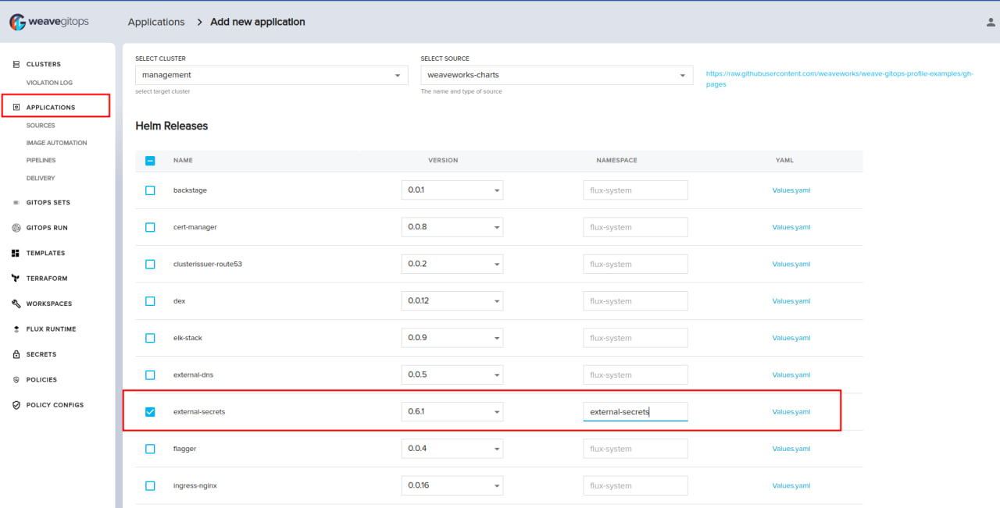
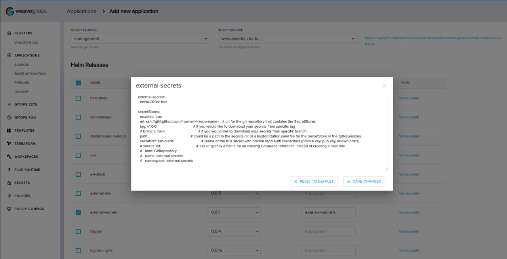
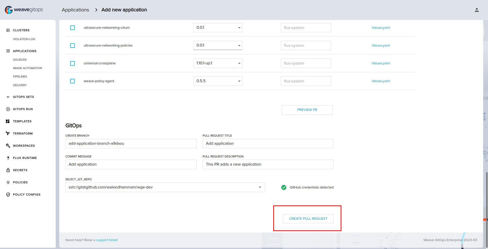
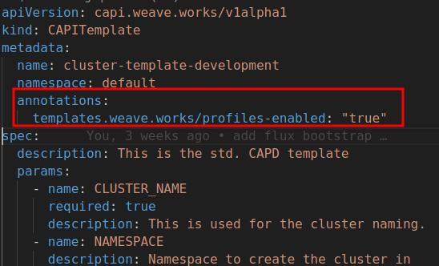
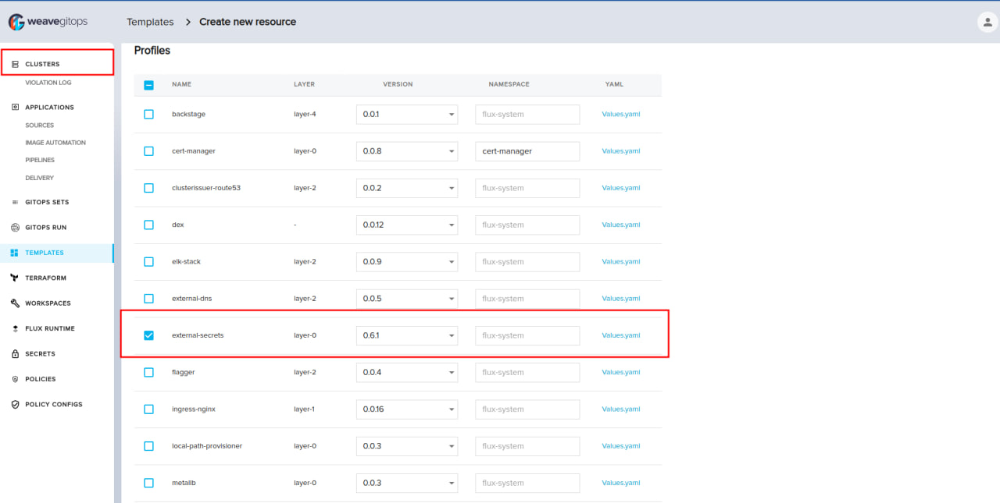
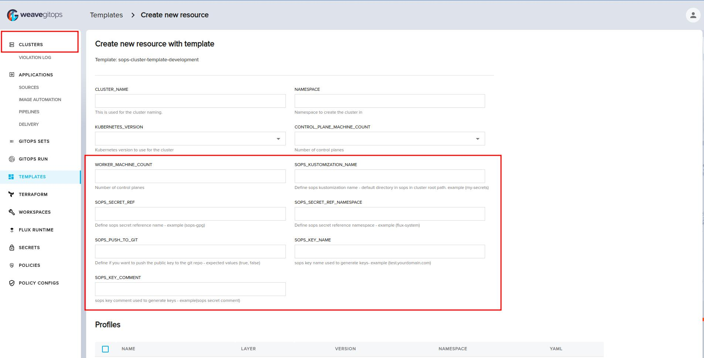

import TierLabel from "../_components/TierLabel";
import CodeBlock from "@theme/CodeBlock";
import BrowserOnly from "@docusaurus/BrowserOnly";

# Setup Secrets Operator

Platform operators face a lot of challenges in bootstrapping and managing secrets in Kubernetes across multiple clusters. 
Specially when storing Kubernetes Secrets in `Git` safely and securely.
To achive this, WGE has two approches to work with kubernetes secrets.

1- [External Secrets Operator](https://external-secrets.io/v0.8.1/)

2- [Mozilla Sops](https://fluxcd.io/flux/guides/mozilla-sops/)

## Set up ESO

ESO can be installed using a [profile](https://github.com/weaveworks/profiles-catalog/tree/main/charts/external-secrets) on any new or existing cluster.

The profile consists of 2 components:

1- The [HelmChart](https://github.com/weaveworks/profiles-catalog/blob/main/charts/external-secrets/Chart.yaml) for External Secrets Operator which installs the operator's helm chart and the operator's CRDs. More info can be found [here](https://external-secrets.io/v0.8.1/examples/gitops-using-fluxcd/)

2- The [Kustomization](https://github.com/weaveworks/profiles-catalog/blob/main/charts/external-secrets/templates/secret-stores-kustomization.yaml) reference to secret stores CRs. This kustomization refers to the git repository with the secrets and can have the values from [values file](https://github.com/weaveworks/profiles-catalog/blob/main/charts/external-secrets/values.yaml) according to your secrets git repository.

### Installation Steps

- [Bootstrap the required secrets](/secrets/bootstraping-secrets.mdx) for the Profile Helm Repository and the Secrets Repository
- Install the [Profile Helm repository](https://docs.gitops.weave.works/docs/gitops-templates/cli/#profiles)
- To install the operator on the management cluster or any existing leaf cluster
    - Go to `Applications` from the side bar and click on `Add an application`.
    - Select `External Secrets` and input your `namespace`
        
    - Then adjust the `values` according to your secrets git repository.
        
    - After that authenticate with github, create and merge the pull request.
        
    - Once flux reconciles the git source, which takes a few minutes, you will find the operator installed and the secrets created in the cluster. You can now use the UI[link to ui page that ali is writting] to create secrets using your external secret operator.
- To bootstrap the operator on a leaf Cluster
    - Go to `Clusters` from the side bar and  click on `Create A Cluster`.
    - Select your template (must have the enable profiles annotation)
        
    - Select `External Secrets` and input your `namespace`
        
    - Then Adjust the `values` according to your secrets git repository
        
    - After that Authenticate with Github, Create and merge the pull request
        
    - Once the cluster is created and Flux reconcile the git source this should take few minutes, you will find the operator installed and the secrets lives in the cluster

## Set up SOPS

- Installing Sops on Managmenet cluster, follow [this guide](/secrets/setup-sops.mdx)

### Bootstrapping Sops to leaf clusters

import SopsBootstrapJob from "!!raw-loader!./assets/sops-bootstrap-job.yaml";
import TemplateParams from "!!raw-loader!./assets/template-params.yaml";
import TemplateAnnotations from "!!raw-loader!./assets/template-annotations.yaml";

- **This will need the following**
`ClusterBootstrapConfig` job to install sops and generate keys when bootstrapping leaf clusters. The following example is using GPG encryption.
        
Create the following ClusterBootstrapConfig CR and push it to your fleet repo. Follow [this guide](/cluster-management/getting-started/#add-a-cluster-bootstrap-config) for more information on ClusterBootstrapConfig.

            

Expand to view 

                <CodeBlock
                title="clusters/management/capi/boostrap/sops-bootstrap-job.yaml"
                className="language-yaml"
                >
                    {SopsBootstrapJob}
                </CodeBlock>
            

        - Template Updates

            In order to install sops, we need some modifications to the template to allow it to create a [Kustomization](https://fluxcd.io/flux/guides/mozilla-sops/#configure-in-cluster-secrets-decryption) for reconciling the secrets on the cluster using sops and to run the `ClusterBootstrapConfig` job during cluster creation.

            It will refer to `sops` location in the root of cluster files

Those are the updates needed:
                - It should have annotation `templates.weave.works/sops-enabled: "true"` to enable WGE to create the kustomization in cluster creation
                - It should have the following values that are needed for the **kustomization**

                - GitOps template with sops enabled (check how to add the annotations below)

                    

Expand to view 

                        <CodeBlock
                        title="clusters/management/capi/boostrap/template.yaml"
                        className="language-yaml"
                        >
                        {TemplateParams}
                        </CodeBlock>
                    

                - It should have the following annotations under `GitOpsCluster` to be used in the bootstrap job

                    

Expand to view 

                        <CodeBlock
                        title="clusters/management/capi/boostrap/template.yaml"
                        className="language-yaml"
                        >
                        {TemplateAnnotations}
                        </CodeBlock>
                    

- **Installation Steps**
    - Go to `Clusters` from the side bar and click on `Create A Cluster`.
    - Select your Sops template (must have the annotation and parameters)
        
    - Fill the data, create and merge the PR.
    - You should expect the following after the cluster is ready:
      - A leaf cluster created with flux & sops bootstrapped
      - A secret created on leaf cluster `sops-gpg` to decrypt secrets
      - A secret created on leaf cluster `sops-gpg-pub` to encrypt secrets
      - A Kustomization with `decryption` defined in it to `sops` location in the cluster repo location
      - A PR is created to the cluster repo with the public key and sops creation rules (optional)
      - Added Role for the public key to be accessed through management cluster
