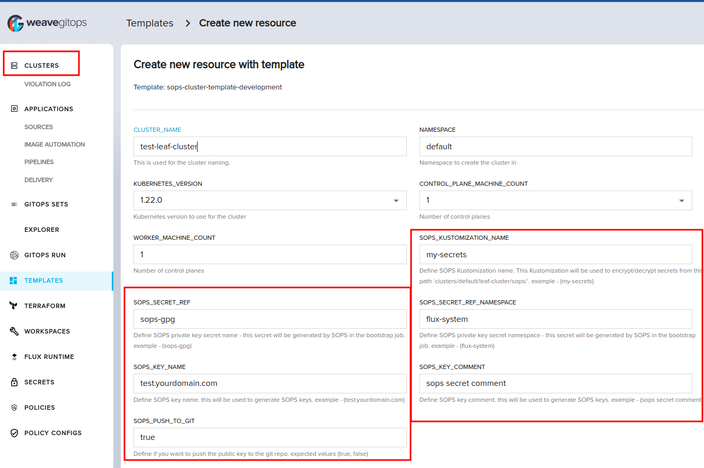

import TierLabel from "../_components/TierLabel";
import CodeBlock from "@theme/CodeBlock";
import BrowserOnly from "@docusaurus/BrowserOnly";

# Setup Secrets Operator

Platform operators face a lot of challenges in bootstrapping and managing secrets in Kubernetes across multiple clusters. 
Specially when storing Kubernetes Secrets in `Git` safely and securely.
To achieve this, WGE has two approaches to work with kubernetes secrets: 
[External Secrets Operator](https://external-secrets.io/v0.8.1/) and [Mozilla SOPS](https://fluxcd.io/flux/guides/mozilla-sops/)

## Set up ESO

ESO can be installed using this [profile](https://github.com/weaveworks/weave-gitops-profile-examples/tree/main/charts/external-secrets) which is packaged with the [weaveworks-charts](https://github.com/weaveworks/weave-gitops-profile-examples) on any new or existing cluster.

### Prerequisites

- ESO [profile](https://github.com/weaveworks/weave-gitops-profile-examples/tree/main/charts/external-secrets) (Packed with `weaveworks-charts`)
- Secrets for the Profile Helm Repository, the Secrets Repository and the Secret Store. Follow this [guide](/secrets/bootstraping-secrets.mdx) for bootstraping secrets on leaf clusters

### Installation Steps

#### Install ESO on management cluster or existing leaf cluster

To install the ESO profile on an exisitng cluster, use `Add an application` from the `Applications` page and select `external-secrets` from `weaveworks-charts`. Check the Profile values section for more info about configuring the `values.yaml`.

#### Install ESO on leaf cluster

To bootstrap the ESO profile on a leaf cluster, select `external-secrets` from the profiles dropdown in the `Create Cluster` page. Check the Profile values section for more info about configuring the `values.yaml`.

#### Profile values

You should then configure the `values.yaml` if you want to install the `SecretStores` on the cluster from a `GitRepository`.
This is done by configuring the `secretStores` section. If your secret stores repo is private, you will also need to reference the Secret that contains the repo credentials. This is usually the [secret](../cluster-management/getting-started.mdx#add-a-cluster-bootstrap-config) you created while bootstrapping flux on the management cluster and is copied to your leaf cluster during creation.

<details><summary>Expand to see an example that creates a new git source from a specific tag</summary>

```yaml
secretStores:
  enabled: true
  url: ssh://git@github.com/github-owner/repo-name   # url for the git repository that contains the SecretStores
  tag: v1.0.0
  path: ./                                           # could be a path to the secrets dir or a kustomization.yaml file for the SecretStore in the GitRepository
  secretRef: my-pat                                  # the name of the secret containing the repo credentials for private repositories
```
</details>

<details><summary>Expand to see an example that uses an existing git source</summary>

```yaml
secretStores:
  enabled: true
  sourceRef: # Specify the name for an existing GitSource reference
    kind: GitRepository
    name: flux-system
    namespace: flux-system
```
</details>


## Set up SOPS

Weave GitOps Enterprise now supports managing secrets using SOPS, a tool that encrypts and decrypts secrets using various key management services, from the [UI](/secrets/manage-secrets-gui.mdx). To be able to use this functionality, users need to configure their private and public key-pairs using one of the guides below.

### Setup SOPS on management cluster or existing leaf cluster

To setup SOPS on management or existing leaf cluster, follow this [guide](/secrets/managing-secrets-with-sops.mdx).

import SopsBootstrapJob from "!!raw-loader!./assets/sops-bootstrap-job.yaml";
import TemplateParams from "!!raw-loader!./assets/template-params.yaml";
import TemplateAnnotations from "!!raw-loader!./assets/template-annotations.yaml";

### Bootstrapping SOPS to leaf clusters

Bootstrapping SOPS to leaf clusters in WGE can be done by utilizing `ClusterBootstrapConfig` job to bootstrap Flux and SOPS.
The job is a container which generates SOPS secrets key pair, creates a kubernetes secret with the private key, creates a kubernetes secret with the public key (to be used in self-serve flow) and the proper rbac for it.
As well as an option to push the public key to the git repository via a PR (to be distributed).

### Prerequisites

#### ClusterBootstrapConfig job

The following example is using GPG encryption to install SOPS and generate keys when bootstrapping leaf clusters. Create the following `ClusterBootstrapConfig` CR and push it to your fleet repo.
        
<details><summary>Expand to view </summary>
    <CodeBlock
    title="clusters/management/capi/boostrap/sops-bootstrap-job.yaml"
    className="language-yaml"
    >
        {SopsBootstrapJob}
    </CodeBlock>
</details>

#### Cluster template updates

In order to bootstrap SOPS to leaf clusters, we need some modifications to the cluster template to allow creating a [Kustomization](https://fluxcd.io/flux/guides/mozilla-sops/#configure-in-cluster-secrets-decryption)
for reconciling the secrets on the cluster using SOPS and to run the `ClusterBootstrapConfig` job during cluster creation.

The template metadata should have annotation, it will be used by WGE to create the Kustomization with the cluster files.

```yaml
templates.weave.works/sops-enabled: "true"
```

The template should have the following parameters that are needed for the Kustomization

<details><summary>Expand to view </summary>
    <CodeBlock
    title="clusters/management/capi/templates/template.yaml"
    className="language-yaml"
    >
    {TemplateParams}
    </CodeBlock>
</details>

The template should have the following annotations under `GitOpsCluster` to be used in the bootstrap job

<details><summary>Expand to view </summary>
    <CodeBlock
    title="clusters/management/capi/templates/template.yaml"
    className="language-yaml"
    >
    {TemplateAnnotations}
    </CodeBlock>
</details>

### Installation Steps

To bootstrap SOPS on a leaf cluster, create a new cluster using the SOPS template from the `Create Cluster` page and fill in the following SOPS-related values in the form: 

- `SOPS_KUSTOMIZATION_NAME`: This Kustomization will be used to decrypt SOPS secrets from this path `clusters/default/leaf-cluster/sops/` after reconciling on the cluster. example (`my-secrets`)
- `SOPS_SECRET_REF`: The private key secret name that will be generated by SOPS in the bootstrap job. example (`sops-gpg`)
- `SOPS_SECRET_REF_NAMESPACE`: The private key secret namespace this secret will be generated by SOPS in the bootstrap job. example (`flux-system`)
- `SOPS_KEY_NAME`: SOPS key name. This will be used to generate SOPS keys. example (`test.yourdomain.com`)
- `SOPS_KEY_COMMENT`: SOPS key comment. This will be used to generate SOPS keys. example (`sops secret comment`)
- `SOPS_PUSH_TO_GIT`: Option to push the public key to the git repository. expected values (`true`, `false`)



### What to expect 

- A leaf cluster created with Flux & SOPS bootstrapped
- A secret created on leaf cluster `sops-gpg` to decrypt secrets
- A secret created on leaf cluster `sops-gpg-pub` to encrypt secrets
- A Kustomization with `decryption` defined in it to `SOPS` location in the cluster repo location
- Added Role for the public key to be accessed through management cluster
- A PR is created to the cluster repo with the public key and SOPS creation rules (optional)
- Visit the Secrets Page and start managing your secrets via the [UI](/secrets/manage-secrets-gui.mdx)
