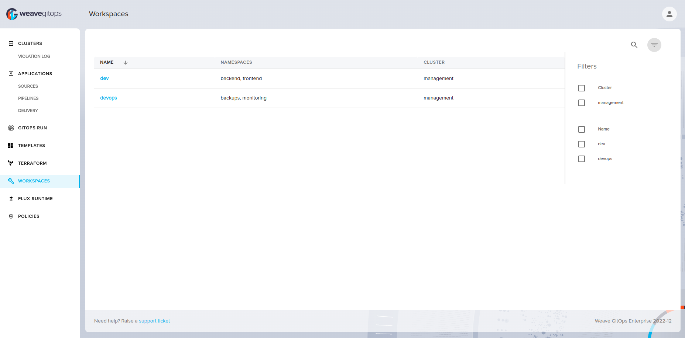

import TierLabel from "./../_components/TierLabel";

<h1>
  {frontMatter.title} <TierLabel tiers="Enterprise" />
</h1>

## Workspaces List View

From the side menu, you can click on the **Workspaces** tab to go to the workspaces list view.

This view lists workspaces across all clusters. You can filter workspaces by their clusters or their names.

## Workspace Details View

You can go to this view by clicking on the name of the workspace in the [Workspaces List View](#workspaces-list-view).

In this view you can see all details of the workspace such as its name, namespace, and all resources related to this workspace.

