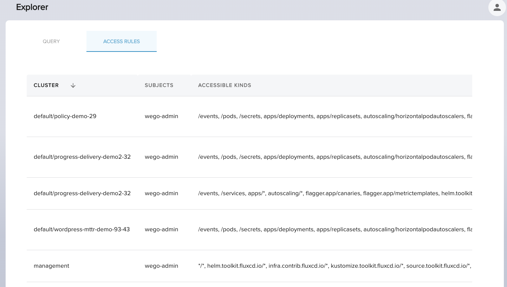

import TierLabel from "./../_components/TierLabel";
import AlphaWarning from "../_components/_alpha_warning.mdx";

# Operations <TierLabel tiers="Enterprise" />

<AlphaWarning/>

As platform engineer you could need to have a finer understanding on the underlying logic for Explorer. The following
options are available to you to operate and troubleshoot it.

## Debug Access Rules

It is a debugging tool to make visible explorer authorization logic. You could find it as tab `Access Rules`  alongside
the `Query` tab.

You could discover by `Cluster` and `Subject` the `Kinds` it is allowed to read. These are the rules that
will be the source of truth doing authorization when a user does a query.

