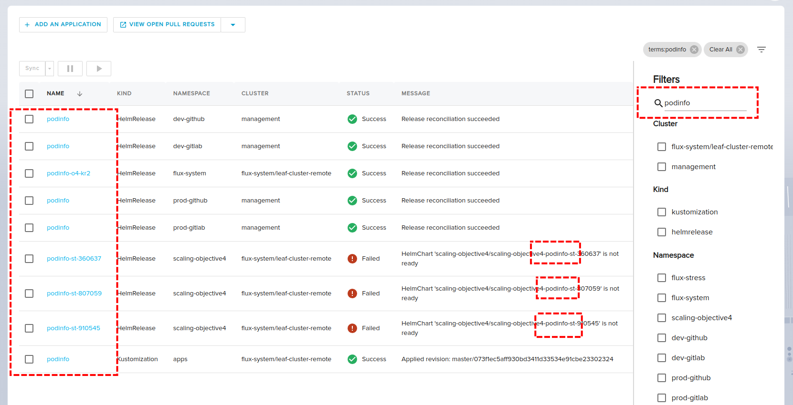

import TierLabel from "./../_components/TierLabel";
import AlphaWarning from "../_components/_alpha_warning.mdx";

# Querying <TierLabel tiers="Enterprise" />

<AlphaWarning/>

Explorer recommended way to discover resources is via its search dialog. This guide provides the background to understand
it and set how to use it.

## Schema

Every resource is normalised to the following common schema:

| __Key__                  | __Description__                                                     |
| -----------------          | --------------                                                  |
| Cluster                    | Name of cluster where the resource exists. As gitops cluster `<GitopsClusterNamespace,GitopsClusterName>`|
| Namespace                  | Namespace name where the resource exists.|
| Kind                  | Resource kubernetes type or [kind](https://kubernetes.io/docs/reference/using-api/api-concepts/#standard-api-terminology)|
| Name                  | Resource name as specified in its manifest.|
| Status                  | Resource health status. Indicates the status of its reconciliation.|
| Message                  | Resource health status message. It extends status field with information about the status.|

For a `podinfo` helm release from a cluster `default/progress-delivery-demo2-32` like this:

```yaml
apiVersion: helm.toolkit.fluxcd.io/v2beta1
kind: HelmRelease
metadata:
  name: podinfo
  namespace: flux-system
spec:
  chart:
    spec:
      chart: podinfo
      interval: 1m
      reconcileStrategy: ChartVersion
      sourceRef:
        kind: HelmRepository
        name: podinfo
      version: 6.0.0
  interval: 1m
status:
  conditions:
  - message: Release reconciliation succeeded
    reason: ReconciliationSucceeded
    status: "True"
    type: Ready
```

The schema looks like

| Cluster    | Namespace | Kind          | Name    | Status    | Message                 |
|------------| ---------| ----------------|---------|----------|------------------------|
|`default/progress-delivery-demo2-32` | `flux-system`   | `HelmRelease` | `podinfo` | `Success` | `Release reconciliation succeeded`  |

You can open the query filter settings by clicking on the filter button:


## Filtering and Searching

The `Search` field allows for free-form text entry to query objects across all fields. For example, if we enter the term "podinfo", we will get matches for not only object names, but also strings from the `Message` field:



To filter the results by cluster, kind, namespace, enable the checkbox filters:


Note that the free-form terms only apply to the filtered results from the kind filter. In this case, we only match the "podinfo" string on results that are `Kustomizations`.

We can also "OR" filters together. Note that filters within a category are OR'd together, but terms are AND'd across categories. For example, selecting the `Kind=Kustomization` and `Kind=HelmRelease` filters will show both `Kustomizations` and `HelmReleases`:


