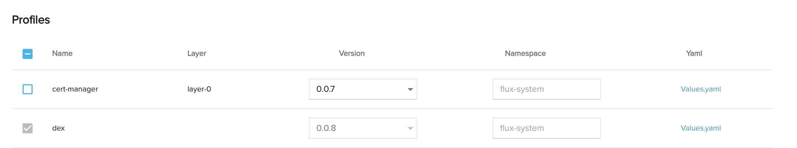

import TierLabel from "../_components/TierLabel";

# Profiles <TierLabel tiers="Enterprise" />

:::note BEFORE YOU START
The following instructions require you to make minor changes to the content of your own hosted Helm repository.
:::

To put it simply, Profiles are [Helm charts](https://helm.sh/docs/topics/charts/). To create a Profile, you need to add an [annotation](https://helm.sh/docs/topics/charts/#the-chartyaml-file) to a Helm chart.

A very simple Helm chart marked up as a Profile looks like this:
```yaml
name: demo-profile
version: 0.0.1
annotations:
  weave.works/profile: "A Demo Profile"
```
The chart can use either [subcharts](https://helm.sh/docs/chart_template_guide/subcharts_and_globals/) or [dependencies](https://helm.sh/docs/chart_best_practices/dependencies/#helm) to include other charts. These other charts do not need the annotation, and they will not show up as Profiles.

## Mark a HelmRepository as Containing Profiles

Alternatively, you can annotate a Flux `HelmRepository`
```yaml
apiVersion: source.toolkit.fluxcd.io/v1beta2
kind: HelmRepository
metadata:
  name: podinfo
  namespace: default
  annotations:
    weave.works/profiles: "true" # this identifies all charts as profiles
spec:
  interval: 5m0s
  url: https://stefanprodan.github.io/podinfo
```  

This will ensure that all charts in the `HelmRepository` are identified as Profiles.

## Add Layers to Define Dependencies Between Your Profiles

Profile layers are a mechanism for loosely defining dependencies between Profiles.

To add a layer to a Profile chart:
```yaml
name: demo-profile
version: 0.0.1
annotations:
  weave.works/profile: "A Demo Profile"
  weave.works/layer: "demo"
```

When multiple Profiles are specified in an API call, with layers in the API request then the set of layers is sorted, reversed, and configured as dependencies using Flux's [dependsOn](https://fluxcd.io/docs/components/helm/helmreleases/#helmrelease-dependencies) mechanism.
```
┌─────────┐      ┌─────────┐      ┌─────────┐
│         │      │         │      │         │
│ layer-3 ├──────► layer-2 ├──────► layer-1 │
│         │      │         │      │         │
└─────────┘      └─────────┘      └─────────┘
 dependsOn        dependsOn
```

The scope of the `dependsOn` calculation is limited to the set of Profiles in the API call.

If only one chart is being installed, no `dependsOn` is configured.

If several charts are installed in the same layer, then the preceeding layer charts will be configured to depend on _all_ the charts in the succeeding layer.
```
┌──────────┐     ┌─────────┐      ┌─────────┐
│          │     │         │      │         │
│ layer-3  ├─────► layer-2 ├──────► layer-1 │
│          │     │         │      │         │
└──────────┤     └─────────┘      └─▲───────┘
 dependsOn │      dependsOn         │
           │                        │
           │     ┌─────────┐        │
           │     │         │        │
           └─────► layer-2 ├────────┘
                 │         │
                 └─────────┘
                  dependsOn
```
If a chart with no layer specified is installed with a chart that has a layer specified, the service will configure the `dependsOn` for the chart without a layer to depend on the chart with layer.

## (Optional) Use a Helm Chart from a Remote Public/Private Repository

You can add your Profiles to a remote repository that can be referenced using a HelmRepository resource. The repository can be either public or private. Using a private repo requires a few extra steps.

In this example, a public repo and branch is referenced directly where the Helm releases are:
```yaml title="HelmRepository.yaml"
apiVersion: source.toolkit.fluxcd.io/v1beta1
kind: HelmRepository
metadata:
  name: weaveworks-charts
  namespace: flux-system
spec:
  interval: 1m
  url: https://weaveworks.github.io/weave-gitops-profile-examples/
```

To use private repositories with restricted access, you can use a [secret synced](../secrets/bootstrapping-secrets.mdx) to the target leaf cluster. SecretSync references the secret as `spec.secretRef`. The labels of your target leaf cluster are added for the syncer to match clusters against those labels using `spec.clusterSelector.matchLabels`.
```yaml title="SecretSync.yaml"
apiVersion: capi.weave.works/v1alpha1
kind: SecretSync
metadata:
  name: my-dev-secret-syncer
  namespace: flux-system
spec:
  clusterSelector:
    matchLabels:
      weave.works/capi: bootstrap
  secretRef:
    name: weave-gitops-enterprise-credentials
  targetNamespace: flux-system
```

Once the SecretSync and Secret are available, the secret can be directly referenced in the HelmRepository object:
```yaml title="PrivateHelmRepository.yaml"
apiVersion: source.toolkit.fluxcd.io/v1beta2
kind: HelmRepository
metadata:
  name: weaveworks-charts
  namespace: flux-system
spec:
  interval: 60m
  secretRef:
    name: weave-gitops-enterprise-credentials
  url: https://charts.dev.wkp.weave.works/releases/charts-v3
  ```
**Note**: The `HelmRepoSecret`, `SecretSync`, and the `GitopsCluster` should all be in the same namespace.

### Select the Profiles You Want Installed at Cluster Creation

WGE inspects the namespace in the management cluster where it is deployed, and looks for a `HelmRepository` object named `weaveworks-charts`. This Kubernetes object should point to a Helm chart repository that includes the Profiles available for installation.

When creating a cluster from the UI using a CAPI template, these Profiles are available for selection in the `Profiles` section of the template. For example:



As shown above, some Profiles are optional, while others are required. This is determined when the template is authored and allows for operations teams to control which Helm packages should be installed on new clusters by default.

To enable editing of the yaml values for required Profiles, add the `editable` flag in the annotation and describe the required Profile in the template. For example: 

```
apiVersion: templates.weave.works/v1alpha2
kind: GitOpsTemplate
metadata:
  name: connect-a-cluster-with-policies
  namespace: default
  annotations:
    capi.weave.works/profile-0: '{"name": "weave-policy-agent", "editable": true, "version": "0.2.8", "values": "accountId: weaveworks\nclusterId: ${CLUSTER_NAME}" }'
```
