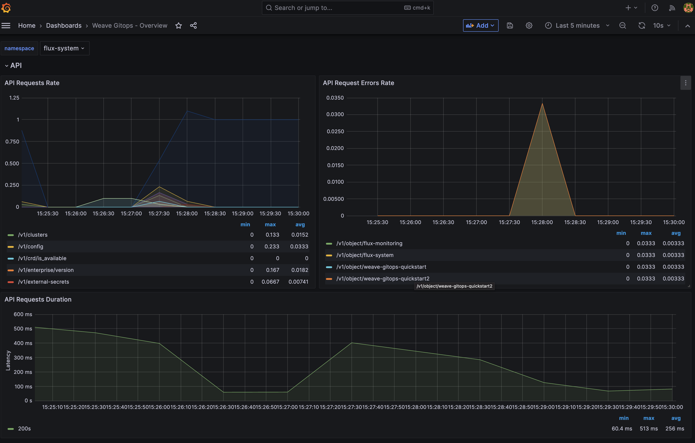
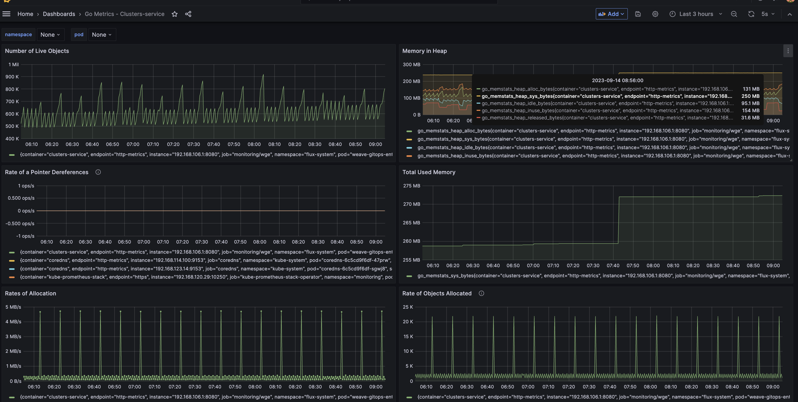
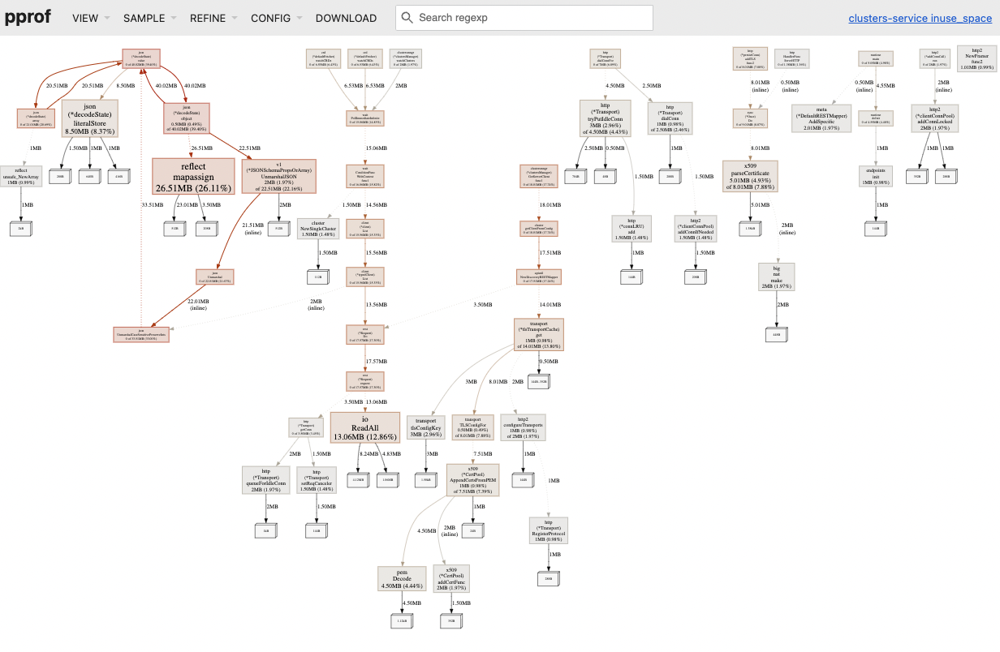

import TierLabel from "./../_components/TierLabel";

# Monitoring <TierLabel tiers="Enterprise" />

Weave GitOps Enterprise provides monitoring telemetry and tooling for metrics and [profiling](#profiling). WGE generates [Prometheus](https://prometheus.io/) metrics for monitoring both performance and business operations.

## Setup

The following configuration options are available for you to configure `monitoring`:

```yaml
---
apiVersion: helm.toolkit.fluxcd.io/v2beta1
kind: HelmRelease
metadata:
  name: weave-gitops-enterprise
  namespace: flux-system
spec:
  values:
    monitoring:
      enabled: true # enable it if you want to expose a monitoring server
      service:
        name: monitoring
        port: 8080 # port to expose the monitoring server
      metrics:
        enabled: true # enable it to expose a prometheus metrics endpoint in `/metrics`
      profiling:
        enabled: false # enable it to expose a pprof debug endpoint  `/debug/pprof`
```

:::caution
The monitoring server holds private services, so you probably won't need to expose anything beyond your cluster. If you must, ensure that it is properly secured.
:::

### Get Started with Monitoring

This setup follows the same [monitoring approach as Flux](https://fluxcd.io/flux/monitoring/metrics/) and is based on [Prometheus Operator](https://prometheus-operator.dev/). Adapt it to your context as needed.

1. [Enable](#setup) the monitoring server with the metrics endpoint.
2. Install [Kube Prometheus Stack](https://github.com/prometheus-community/helm-charts/tree/main/charts/kube-prometheus-stack).

<details>
<summary>Expand to see manifest contents</summary>

```yaml
apiVersion: source.toolkit.fluxcd.io/v1
kind: GitRepository
metadata:
  name: weave-gitops-quickstart
  namespace: flux-system
spec:
  interval: 10m0s
  ref:
    branch: main
  url: https://github.com/weaveworks/weave-gitops-quickstart
---
apiVersion: v1
kind: Namespace
metadata:
  name: monitoring
---
apiVersion: kustomize.toolkit.fluxcd.io/v1
kind: Kustomization
metadata:
  name: kube-prometheus-stack
  namespace: flux-system
spec:
  interval: 10m0s
  sourceRef:
    kind: GitRepository
    name: weave-gitops-quickstart
  path: ./monitoring/kube-prometheus-stack
  prune: true
  targetNamespace: monitoring
  wait: true
```

</details>

3. Deploy Weave GitOps Monitoring Config

<details>
<summary>Expand to see manifest contents</summary>

```yaml
apiVersion: kustomize.toolkit.fluxcd.io/v1
kind: Kustomization
metadata:
  name: monitoring-config
  namespace: flux-system
spec:
  interval: 10m0s
  sourceRef:
    kind: GitRepository
    name: weave-gitops-quickstart
  path: ./monitoring/weave-gitops
  dependsOn:
    - name: kube-prometheus-stack
  prune: true
  targetNamespace: monitoring
```

</details>

4. See the dashboards in Grafana. You can filter by tags `flux` or `weave-gitops`.


### Dashboards

**Weave GitOps Overview**

Monitor Weave GitOps golden signals for API server and controllers:



**Weave GitOps Runtime**

Monitor Weave GitOps Go runtime metrics like memory usage, memory heap, and Goroutines, among others.



**Explorer**

You can also monitor [Explorer golden signals](../../explorer/operations#monitoring).

## Profiling

During operations, profiling is useful for gaining a deeper understanding of how Weave GitOps runtime behaves.
Given that Weave GitOps is written in Go, profiling happens through [pprof](https://pkg.go.dev/runtime/pprof). It is
exposed as a web endpoint by [pprof http](https://pkg.go.dev/net/http/pprof).

### Get Started with Profiling

1. [Enable](#setup) the monitoring server with the profiling endpoint.
2. Navigate to your monitoring server URL to the `/debug/pprof` path where the pprof web interface is exposed.



[Go here](https://github.com/google/pprof/blob/main/doc/README.md) for more info on using `pprof`.
