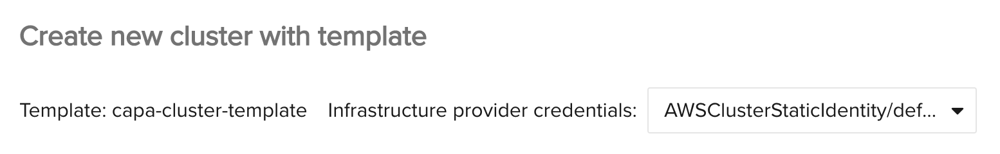

import TierLabel from "@site/docs/_components/TierLabel";

# How to Inject Credentials Into Your Template <TierLabel tiers="Enterprise" />

Weave GitOps _templates_ describe the properties of your cluster—how many nodes, what version of Kubernetes, etc. The _identity_ refers to which account will be used to create the cluster. When you render a template, you may want to set the credentials to be used for this cluster—for example, if the cost is allocated to a specific team.

The rendered resource can be automatically configured with the selected credentials.

Credentials are injected into the following resources:
* AWSCluster, AWSManagedControlPlane
* AzureCluster, AzureManagedCluster
* VSphereCluster

If no credentials are selected, no changes will be applied, and the credentials used by your CAPI controller will be used as the default.

In our cluster we have the template:

```yaml
apiVersion: templates.weave.works/v1alpha2
kind: GitOpsTemplate
metadata:
  name: capa-cluster-template
spec:
  resourcetemplates:
    - contents:
      - apiVersion: infrastructure.cluster.x-k8s.io/v1alpha4
        kind: AWSCluster
        metadata:
          name: "${CLUSTER_NAME}"
        spec:
          region: "${AWS_REGION}"
```

and the identity

```yaml
apiVersion: infrastructure.cluster.x-k8s.io/v1alpha3
kind: AWSClusterStaticIdentity
metadata:
  name: "test-account"
spec:
  secretRef:
    name: test-account-creds
    namespace: capa-system
  allowedNamespaces:
    selector:
      matchLabels:
        cluster.x-k8s.io/ns: "testlabel"
```

We can select Weave GitOps to use the `test-account` when creating the cluster by using the _Infrastructure provider credentials_ dropdown on the _Create new cluster with template_ page:



The resulting definition will have the identity injected into the appropriate place in the template, for this example:

```yaml
apiVersion: infrastructure.cluster.x-k8s.io/v1alpha4
kind: AWSCluster
metadata:
  name: example-cluster
spec:
  region: eu-north-1
  identityRef:
    kind: AWSClusterStaticIdentity
    name: test-account
```

### `identityRef`s

The supported providers implement multi-tenancy by setting an `identityRef` on the the provider cluster object, e.g. `AWSCluster`, `AzureCluster` or `VSphereCluster`.

Weave GitOps will search _all namespaces_ in the cluster for potential identities that can be used to create a cluster. The following identity `kind`s are currently supported and their corresponding Cluster kinds:

- `AWSClusterStaticIdentity`: `AWSCluster`
- `AWSClusterRoleIdentity`: `AWSCluster`
- `AzureClusterIdentity`: `AzureCluster`
- `VSphereClusterIdentity`: `VSphereCluster`
