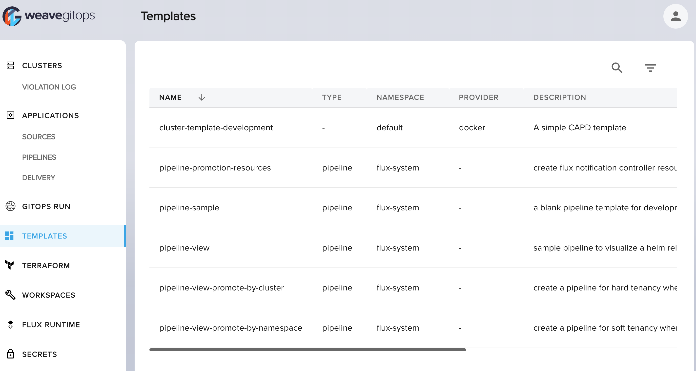

import TierLabel from "../_components/TierLabel";

# Introduction <TierLabel tiers="Enterprise" />

A `GitOpsTemplate` enables application developers to self-service components and
services easily through the Weave GitOps Dashboard. It's a simple YAML file that you can enrich with parameters, variables,
metadata, and conditions.

Use a `GitOpsTemplate` to template any resource that can be expressed in YAML
(basic Kubernetes resources, Flux primitives, Terraform controller, Crossplane, Cluster API, etc.)
into a standardised definition.

Application developers can use a template through our GUI. The rendered
template is added to their GitOps repository via a pull request. When merged and reconciled, the resources in
the template are created. A resource can be a `MachinePool` for
CAPI objects, a Flux Kustomization, or a Terraform Controller resource, to name a few examples.

:::tip

A `GitOpsTemplate` must be valid `yaml`. Beyond
this, a rendered template can create any resource you need :sparkles:.

:::

:::info

GitOpsTemplate or CAPITemplate?

The only difference between `CAPITemplate` and `GitOpsTemplate` is the default
value of these two annotations:

| Annotation | default value for `CAPITemplate` | default value for `GitOpsTemplate` |
| ----------- | ---------------- | ------------------ |
| `templates.weave.works/add-common-bases`  | `"true"` | `"false"` |
| `templates.weave.works/inject-prune-annotations` | `"true"` | `"false"` |

:::

